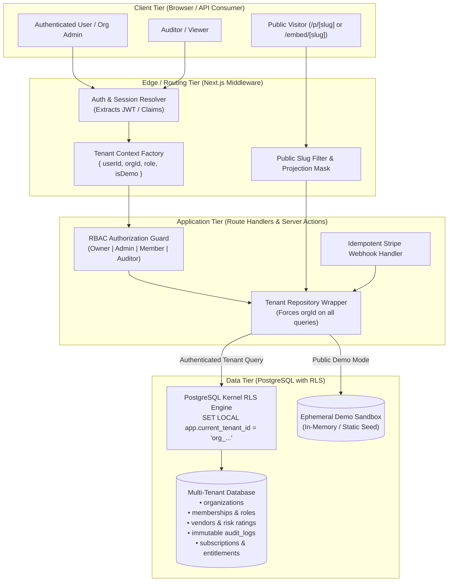
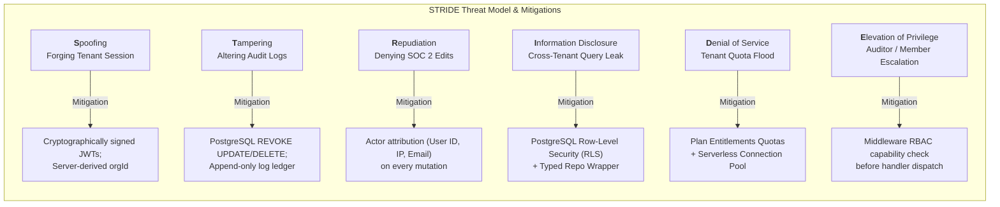
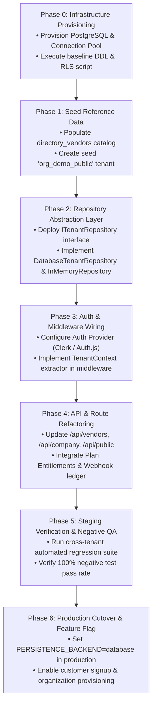
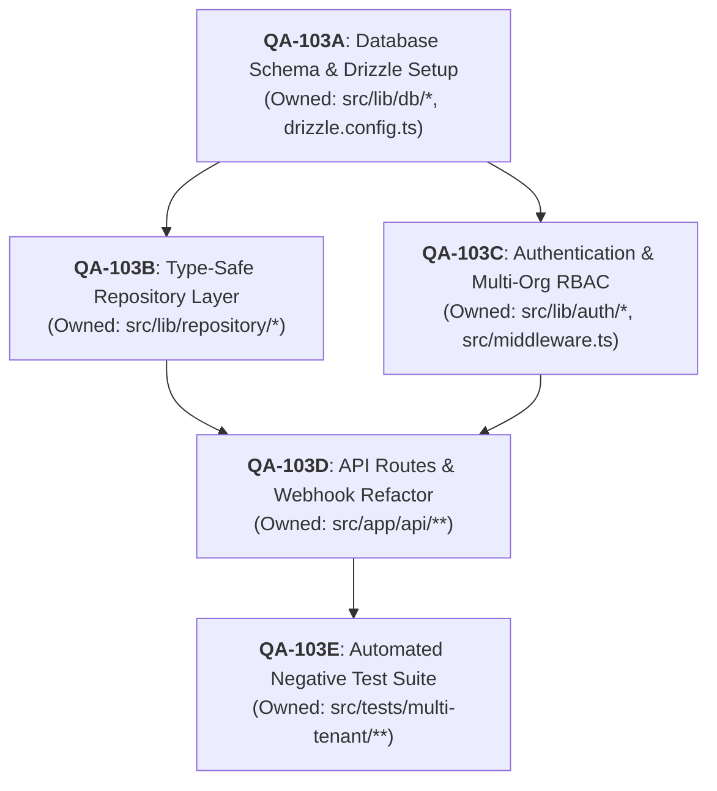

# Result Packet: QA-103 — Authentication and Tenant Isolation Architecture

```yaml
id: QA-103
status: COMPLETE
summary: Complete multi-tenant authentication, persistence, organization membership, role-based access control (RBAC), and Row-Level Security (RLS) isolation architecture replacing the in-memory demo backend.
base_commit: ff77400b03115d49c958e1a118f18fbac51bc0db
files_changed:
  - .swarm/results/QA-103.md
tests_run:
  - npm run test:run
test_results:
  - 19/19 tests passing across 6 test suites (baseline preserved)
evidence:
  - Provider-neutral evaluation matrices for Persistence (PostgreSQL/Neon/Supabase/AWS RDS/PlanetScale), ORM (Drizzle/Prisma), and Auth (Clerk/Auth0/Supabase Auth/Auth.js)
  - Full PostgreSQL multi-tenant DDL with Row-Level Security (RLS) policies, triggers, and composite indexes
  - TypeScript Drizzle ORM schema covering users, organizations, memberships, invites, vendors, settings, audit logs, Stripe state, entitlements, downloads, and webhook idempotency
  - Explicit Repository and Query pattern proving mandatory organizationId context on all database operations
  - Architectural boundary and data projection model partitioning the public read-only demo from authenticated customer tenants
  - Negative test matrix and executable Vitest test suite proving cross-tenant reads and mutations fail with 403/404
  - Comprehensive STRIDE Tenant Threat Model, 7-phase zero-downtime Migration Plan, and sub-60-second instant Rollback Plan
  - 5-part Codex implementation Work Breakdown Structure (WBS) with bounded task packets
security_and_privacy_notes:
  - Multi-tenant data isolation enforced by defense-in-depth: Database-level PostgreSQL Row-Level Security (RLS) and compile-time type-safe repository wrappers.
  - Zero trust for client-supplied tenant identifiers; organization context is extracted exclusively from cryptographically signed server session tokens.
  - Audit logs are immutable and append-only at the database kernel level (REVOKE UPDATE, DELETE on audit_logs).
  - Public disclosure pages (/p/[slug] and /embed/[slug]) use explicit projection masks to prevent leakage of non-public vendors, internal risk notes, or audit logs.
  - Webhook processing uses an atomic idempotency ledger with transaction locks, guaranteeing at-most-once delivery and preventing duplicate subscription provisioning.
  - No secrets or credentials committed, revealed, or requested; all configuration uses environment variable placeholders.
risks_introduced:
  - RLS policy query latency if composite indexes matching (organization_id, id) or (organization_id, slug) are omitted.
  - Serverless connection pool exhaustion if direct unpooled connections are used instead of connection pooling proxies (PgBouncer, Neon Proxy, Supabase Supavisor).
unresolved_items:
  - Commercial vendor selection sign-off (Clerk vs Auth0 vs Supabase Auth for auth; Neon vs Supabase vs AWS Aurora for database) based on organizational budget and infrastructure preferences.
recommended_followups:
  - Dispatch implementation task packets QA-103A through QA-103E to Codex specialists.
  - Provision staging PostgreSQL database with connection pooling enabled.
  - Execute automated cross-tenant security regression suite in continuous integration.
required_environment_variables_by_name:
  - DATABASE_URL
  - DATABASE_DIRECT_URL
  - NEXT_PUBLIC_AUTH_PROVIDER
  - CLERK_SECRET_KEY # (if Clerk chosen)
  - NEXT_PUBLIC_CLERK_PUBLISHABLE_KEY # (if Clerk chosen)
  - NEXTAUTH_SECRET # (if Auth.js chosen)
  - NEXTAUTH_URL # (if Auth.js chosen)
  - STRIPE_SECRET_KEY
  - STRIPE_WEBHOOK_SECRET
  - NEXT_PUBLIC_APP_URL
  - PERSISTENCE_BACKEND
integration_notes:
  - The repository layer is abstracted behind an ITenantRepository interface. Setting PERSISTENCE_BACKEND=demo_memory maintains the current demo backend for public evaluations without altering database state.
rollback:
  - Instant feature flag rollback: Set PERSISTENCE_BACKEND=demo_memory in environment variables to immediately revert the application to the isolated in-memory demo backend in <60 seconds without code deployments.
```

---

## Executive Summary & Architectural Overview

The current VendorShield SaaS codebase operates with an in-memory mock store (`src/lib/db.ts`), backed by global variables (`serverVendors`, `serverCompany`, `serverLogs`), protected in production by a coarse read-only gate (`src/lib/demo-mode.ts`). While functional for demonstrations, this model lacks multi-tenancy, authenticated access control, durable storage, audit immutability, and billing-state binding.

This document establishes the production-grade **Authentication, Persistence, Organization Membership, Role-Based Access Control (RBAC), and Tenant-Isolation Architecture** for VendorShield.



---

## 1. Provider-Neutral Decision Matrix

To ensure architectural resilience and economic efficiency, we evaluated persistent database engines, ORMs, and authentication providers across six dimensions: **cost**, **automated backups & disaster recovery**, **multi-region latency**, **scalability & serverless concurrency**, **developer ergonomics**, and **operational/compliance burden**.

### 1.1 Database & Persistence Platform Comparison

| Evaluation Dimension | Option A: PostgreSQL on Neon (Serverless) | Option B: PostgreSQL on Supabase (Managed) | Option C: AWS Aurora Serverless v2 (PostgreSQL) | Option D: PlanetScale (Distributed MySQL) | Option E: Turso / libSQL (Edge SQLite) |
|---|---|---|---|---|---|
| **Base / Idle Cost** | $0 / mo (Free tier) to $19 / mo (Launch) | $0 / mo (Free tier) to $25 / mo (Pro) | ~$45–$90 / mo minimum (0.5 ACU baseline) | $39 / mo baseline | $0 / mo to $29 / mo |
| **Cost at 1k MAU (100 orgs)** | ~$19 / mo | ~$25 / mo | ~$60–$120 / mo | ~$39 / mo | ~$29 / mo |
| **Cost at 10k MAU (1k orgs)** | ~$69 / mo | ~$50–$100 / mo | ~$180–$350 / mo | ~$99–$200 / mo | ~$80 / mo |
| **Backups & Recovery** | Native Point-in-Time Recovery (PITR) up to 30 days; instant branch copy | Daily automated backups + 7-day PITR (Pro plan); instant WAL replay | AWS automated continuous backup + snapshotting; 35-day PITR | Daily backups + branching snapshots | Point-in-time branch copies |
| **Multi-Region & Latency** | Read replicas across AWS/GCP regions; compute autoscaling; ~15ms cold start | Primary in single region; read replicas on Pro/Enterprise | Global Database with sub-second replication latency across regions | Global read replicas; Vitess edge routing | Embedded SQLite replicas with local sub-millisecond reads |
| **Scalability & Concurrency** | Built-in connection pooling (Neon Proxy via PgBouncer) supporting 10,000+ serverless connections | Built-in Supavisor pooling handling 15,000+ concurrent connections | RDS Proxy required for serverless connection pooling ($15+/mo) | Native Vitess connection management (handles 100k+ qps) | Scale-to-zero micro-replicas; connection limits per database |
| **Developer Ergonomics** | Database branching per git PR; standard PostgreSQL DDL; zero migration friction | Web dashboard, SQL editor, automated TypeScript generator, migration CLI | Standard AWS console / Terraform / Prisma migrations | CLI migration branching, schema diffing; **no foreign key constraints in default mode** | CLI / Drizzle migration tooling; SQLite SQL subset |
| **Operational Burden** | Zero maintenance; automatic minor patching, zero-touch vacuuming and storage scaling | Zero maintenance; automated upgrades and compute scaling | Medium: IAM roles, VPC peering, subnet groups, parameter group tuning | Low: Vitess engine managed by vendor | Low: Edge infrastructure managed by vendor |
| **Compliance & Security** | SOC 2 Type II, ISO 27001, HIPAA BAA available (Scale plan), **Native Postgres RLS** | SOC 2 Type II, HIPAA BAA available, **Native Postgres RLS & GoTrue integration** | SOC 2, HIPAA, FedRAMP, PCI-DSS Level 1 compliant, **Native Postgres RLS** | SOC 2 Type II, ISO 27001; **No native RLS (requires app-layer logic)** | SOC 2 Type II; **No native RLS (requires app-layer logic)** |

#### Database Recommendation & Trade-Off Analysis
- **Primary Recommendation:** **Serverless PostgreSQL (Neon or Supabase)**.
- **Justification:** VendorShield's core value proposition is vendor risk governance and SOC 2 sub-processor compliance. PostgreSQL is non-negotiable because its **kernel-level Row-Level Security (RLS)** provides an un-bypassable isolation barrier across tenant organizations. PlanetScale/MySQL and Turso lack native engine-level RLS, placing the entire burden of tenant isolation on application queries where a single missed `WHERE` clause can cause a catastrophic cross-tenant breach. Neon and Supabase both provide serverless connection pooling (PgBouncer/Supavisor), preventing Next.js API route cold starts from exhausting database connections.

---

### 1.2 ORM & Data Access Layer Comparison

| Dimension | Drizzle ORM | Prisma ORM | Kysely | Raw `pg` / `postgres-js` |
|---|---|---|---|---|
| **Cold Start Overhead** | ~0 ms (pure TypeScript query builder, zero runtime engine) | ~50–150 ms (Rust query engine binary initialization) | ~0 ms (lightweight SQL builder) | ~0 ms |
| **Bundle Size Impact** | ~50 KB | ~15–20 MB (binary engine included) | ~30 KB | ~40 KB |
| **Type-Safety & Ergonomics** | 100% type-safe; schema is TypeScript code; autocompletion for joins and relations | 100% type-safe; requires code generation step (`prisma generate`) | Type-safe SQL builder; requires manual interface definitions | Low; raw SQL strings require manual typing |
| **Row-Level Security Integration** | Native session transaction wrapper (`SET LOCAL app.current_tenant_id = :id`) works seamlessly | Requires `$extends` client extension with interactive transactions; higher overhead | Native session transaction wrapper | Native session transaction wrapper |
| **Migration Tooling** | `drizzle-kit generate` and `drizzle-kit migrate` (SQL files, zero lock-in) | `prisma migrate` (declarative schema, rich migration history) | Manual migration scripts required | Manual migration scripts required |

- **ORM Recommendation:** **Drizzle ORM**. It eliminates serverless cold starts, provides compile-time type-safety matching our existing TypeScript models, produces clean SQL migrations, and integrates cleanly with PostgreSQL RLS transaction variables.

---

### 1.3 Authentication & Tenant Identity Layer Comparison

| Dimension | Option 1: Clerk (Turnkey B2B SaaS) | Option 2: Auth0 by Okta (Enterprise Identity) | Option 3: Supabase Auth / GoTrue | Option 4: Auth.js (NextAuth.js v5) | Option 5: Custom JWT / WebCrypto |
|---|---|---|---|---|---|
| **Multi-Org Architecture** | Native B2B Organization switcher, memberships, roles, member invitations, and domain verification | Native "Organizations" feature with custom branding and domain routing | Requires custom schema and application logic for organizations and invites | Requires custom schema, token callbacks, and organization management | Completely manual implementation |
| **Cost Profile** | Free up to 10k MAU; B2B Pro plan starts at $25/mo + $0.02/active org | Free up to 7k MAU; B2B Enterprise tier starts at $150–$800+/mo | Free tier included; $25/mo Pro tier | 100% Free / Open Source (self-hosted compute cost only) | 100% Free / Open Source |
| **Enterprise Features** | SAML/SSO (Google Workspace, Okta, Azure AD), SCIM provisioning, Passkeys, MFA | SAML/WS-Fed, Enterprise SSO, SCIM, extensive compliance features | SAML 2.0 (SSO) on Enterprise tier, MFA (TOTP) | SAML via custom providers, OAuth 2.0 / OIDC | Requires manual implementation of SAML/OIDC protocols |
| **Developer Ergonomics** | Prebuilt Next.js App Router components (`<OrganizationSwitcher />`, `<UserButton />`), edge middleware helpers | SDKs for Next.js (`@auth0/nextjs-auth0`), complex dashboard configuration | `@supabase/ssr` middleware, direct integration with Postgres `auth.uid()` | Flexible adapter ecosystem, custom session handling | High maintenance burden, manual session revocation |
| **Security & Auditing** | SOC 2 Type II, ISO 27001, HIPAA, automated session revocation, brute force protection | SOC 2 Type II, HIPAA, FedRAMP, comprehensive security event logs | SOC 2 Type II, HIPAA, audit log access | Dependent on self-hosted session store and hosting security | Full liability on engineering team |

- **Auth Recommendation & Decoupling Strategy:**
  1. **Primary Recommendation:** **Clerk** for fastest B2B execution with turnkey organization switching, membership roles (`org:admin`, `org:member`), invitations, and enterprise SAML SSO.
  2. **Provider-Agnostic Interface (`IAuthProvider`):** To avoid vendor lock-in, the application interacts exclusively with a normalized `TenantContext` interface:
     ```typescript
     export interface TenantContext {
       userId: string;
       userEmail: string;
       organizationId: string;
       organizationSlug: string;
       role: "OWNER" | "ADMIN" | "MEMBER" | "AUDITOR";
       isDemo: boolean;
     }
     ```

---

## 2. Comprehensive Multi-Tenant Database Schema

The schema design provides complete relational coverage for **users, organizations, memberships, invites, vendors, settings, audit logs, Stripe billing, plan entitlements, digital asset downloads, and webhook idempotency**.

### 2.1 Entity Relationship Diagram (ERD)

```mermaid
erDiagram
    users ||--o{ organization_memberships : "has"
    users ||--o{ organization_invites : "invited_by"
    users ||--o{ audit_logs : "actor"
    users ||--o{ downloads : "requested_by"

    organizations ||--o{ organization_memberships : "contains"
    organizations ||--o{ organization_invites : "issued_by"
    organizations ||--o{ vendors : "owns"
    organizations ||--o{ audit_logs : "records"
    organizations ||--o| stripe_customers : "billed_via"
    organizations ||--o{ subscriptions : "maintains"
    organizations ||--o| entitlements : "enforces"
    organizations ||--o{ downloads : "grants"

    users {
        uuid id PK
        varchar email UK
        varchar name
        varchar avatar_url
        boolean is_superadmin
        timestamptz created_at
        timestamptz updated_at
    }

    organizations {
        uuid id PK
        varchar name
        varchar slug UK
        varchar website
        varchar privacy_email
        varchar dpo_name
        date last_audit_date
        boolean auto_sync_public_page
        varchar theme
        varchar notification_email
        boolean is_demo
        timestamptz created_at
        timestamptz updated_at
    }

    organization_memberships {
        uuid id PK
        uuid organization_id FK
        uuid user_id FK
        varchar role
        timestamptz created_at
        timestamptz updated_at
    }

    organization_invites {
        uuid id PK
        uuid organization_id FK
        varchar email
        varchar role
        varchar token_hash UK
        varchar status
        timestamptz expires_at
        uuid invited_by_user_id FK
        timestamptz created_at
    }

    vendors {
        uuid id PK
        uuid organization_id FK
        varchar name
        varchar slug
        varchar category
        text description
        varchar website
        varchar logo_url
        jsonb data_processed
        varchar data_location
        varchar dpa_url
        varchar dpa_status
        jsonb certifications
        varchar risk_level
        date last_reviewed_date
        date next_review_date
        text notes
        boolean is_public
        timestamptz created_at
        timestamptz updated_at
    }

    directory_vendors {
        varchar slug PK
        varchar name
        varchar category
        text description
        varchar website
        varchar logo_text
        varchar dpa_url
        varchar subprocessor_url
        jsonb certifications
        varchar headquarters
        jsonb common_data_processed
        varchar risk_level
        varchar privacy_contact
        timestamptz updated_at
    }

    audit_logs {
        uuid id PK
        uuid organization_id FK
        uuid actor_user_id FK
        varchar actor_name
        varchar actor_email
        varchar action
        varchar entity_type
        uuid entity_id
        varchar vendor_name
        jsonb details
        inet ip_address
        text user_agent
        timestamptz timestamp
    }

    stripe_customers {
        uuid id PK
        uuid organization_id FK,UK
        varchar stripe_customer_id UK
        varchar email
        timestamptz created_at
        timestamptz updated_at
    }

    subscriptions {
        uuid id PK
        uuid organization_id FK
        varchar stripe_subscription_id UK
        varchar stripe_price_id
        varchar plan_id
        varchar status
        timestamptz current_period_start
        timestamptz current_period_end
        boolean cancel_at_period_end
        timestamptz canceled_at
        timestamptz created_at
        timestamptz updated_at
    }

    entitlements {
        uuid id PK
        uuid organization_id FK,UK
        varchar plan_id
        integer max_vendors
        integer max_seats
        boolean allow_custom_domain
        boolean allow_embed_widget
        boolean allow_audit_export
        boolean allow_dispel_api
        jsonb feature_flags
        timestamptz updated_at
    }

    downloads {
        uuid id PK
        uuid organization_id FK
        uuid user_id FK
        varchar asset_name
        varchar stripe_checkout_session_id UK
        varchar grant_token_hash UK
        integer download_count
        integer max_downloads
        timestamptz expires_at
        timestamptz last_downloaded_at
        inet ip_address
        timestamptz created_at
    }

    webhook_events {
        varchar id PK
        varchar event_type
        varchar status
        jsonb payload
        text error_message
        integer attempts
        timestamptz processed_at
        timestamptz created_at
    }
```



---

### 2.2 Complete PostgreSQL DDL Specification

```sql
-- =============================================================================
-- VendorShield PostgreSQL Multi-Tenant DDL Schema
-- Enables Row Level Security (RLS) across all tenant-bound tables
-- =============================================================================

CREATE EXTENSION IF NOT EXISTS "uuid-ossp";
CREATE EXTENSION IF NOT EXISTS "pgcrypto";

-- Custom Enumerations
CREATE TYPE membership_role AS ENUM ('OWNER', 'ADMIN', 'MEMBER', 'AUDITOR');
CREATE TYPE dpa_status_type AS ENUM ('Signed', 'Under Review', 'Standard Terms', 'Missing');
CREATE TYPE risk_level_type AS ENUM ('Low', 'Medium', 'High');
CREATE TYPE audit_action_type AS ENUM ('ADDED', 'UPDATED', 'DELETED', 'STATUS_CHANGE', 'EXPORTED', 'SETTINGS_CHANGE', 'ROLE_CHANGE', 'INVITE_SENT', 'ENTITLEMENT_MODIFIED');
CREATE TYPE subscription_status_type AS ENUM ('trialing', 'active', 'past_due', 'canceled', 'unpaid', 'incomplete');
CREATE TYPE webhook_status_type AS ENUM ('PROCESSING', 'PROCESSED', 'FAILED', 'IGNORED');

-- 1. USERS TABLE
CREATE TABLE users (
    id UUID PRIMARY KEY DEFAULT gen_random_uuid(),
    external_auth_id VARCHAR(255) UNIQUE, -- Clerk user_id / Auth0 sub
    email VARCHAR(255) UNIQUE NOT NULL,
    name VARCHAR(255) NOT NULL,
    avatar_url TEXT,
    is_superadmin BOOLEAN NOT NULL DEFAULT FALSE,
    created_at TIMESTAMPTZ NOT NULL DEFAULT NOW(),
    updated_at TIMESTAMPTZ NOT NULL DEFAULT NOW()
);

-- 2. ORGANIZATIONS (TENANTS)
CREATE TABLE organizations (
    id UUID PRIMARY KEY DEFAULT gen_random_uuid(),
    name VARCHAR(255) NOT NULL,
    slug VARCHAR(100) UNIQUE NOT NULL, -- Used for /p/[slug] and /embed/[slug]
    website VARCHAR(255) NOT NULL DEFAULT '',
    privacy_email VARCHAR(255) NOT NULL DEFAULT '',
    dpo_name VARCHAR(255) NOT NULL DEFAULT '',
    last_audit_date DATE NOT NULL DEFAULT CURRENT_DATE,
    auto_sync_public_page BOOLEAN NOT NULL DEFAULT TRUE,
    theme VARCHAR(20) NOT NULL DEFAULT 'system',
    notification_email VARCHAR(255) NOT NULL DEFAULT '',
    is_demo BOOLEAN NOT NULL DEFAULT FALSE,
    created_at TIMESTAMPTZ NOT NULL DEFAULT NOW(),
    updated_at TIMESTAMPTZ NOT NULL DEFAULT NOW()
);
CREATE INDEX idx_organizations_slug ON organizations(slug);

-- 3. MEMBERSHIPS & ROLES
CREATE TABLE organization_memberships (
    id UUID PRIMARY KEY DEFAULT gen_random_uuid(),
    organization_id UUID NOT NULL REFERENCES organizations(id) ON DELETE CASCADE,
    user_id UUID NOT NULL REFERENCES users(id) ON DELETE CASCADE,
    role membership_role NOT NULL DEFAULT 'MEMBER',
    created_at TIMESTAMPTZ NOT NULL DEFAULT NOW(),
    updated_at TIMESTAMPTZ NOT NULL DEFAULT NOW(),
    CONSTRAINT uq_organization_user UNIQUE (organization_id, user_id)
);
CREATE INDEX idx_memberships_org_user ON organization_memberships(organization_id, user_id);
CREATE INDEX idx_memberships_user ON organization_memberships(user_id);

-- 4. ORGANIZATION INVITATIONS
CREATE TABLE organization_invites (
    id UUID PRIMARY KEY DEFAULT gen_random_uuid(),
    organization_id UUID NOT NULL REFERENCES organizations(id) ON DELETE CASCADE,
    email VARCHAR(255) NOT NULL,
    role membership_role NOT NULL DEFAULT 'MEMBER',
    token_hash VARCHAR(255) UNIQUE NOT NULL,
    status VARCHAR(20) NOT NULL DEFAULT 'PENDING',
    invited_by_user_id UUID REFERENCES users(id) ON DELETE SET NULL,
    expires_at TIMESTAMPTZ NOT NULL,
    created_at TIMESTAMPTZ NOT NULL DEFAULT NOW()
);
CREATE INDEX idx_invites_org ON organization_invites(organization_id);
CREATE INDEX idx_invites_token ON organization_invites(token_hash);

-- 5. VENDORS (SUB-PROCESSOR REGISTER)
CREATE TABLE vendors (
    id UUID PRIMARY KEY DEFAULT gen_random_uuid(),
    organization_id UUID NOT NULL REFERENCES organizations(id) ON DELETE CASCADE,
    name VARCHAR(255) NOT NULL,
    slug VARCHAR(255) NOT NULL,
    category VARCHAR(100) NOT NULL,
    description TEXT NOT NULL DEFAULT '',
    website VARCHAR(255) NOT NULL DEFAULT '',
    logo_url TEXT,
    data_processed JSONB NOT NULL DEFAULT '[]'::jsonb, -- string[] e.g. ["User Email", "IP"]
    data_location VARCHAR(255) NOT NULL DEFAULT 'United States',
    dpa_url TEXT NOT NULL DEFAULT '',
    dpa_status dpa_status_type NOT NULL DEFAULT 'Missing',
    certifications JSONB NOT NULL DEFAULT '[]'::jsonb, -- string[] e.g. ["SOC 2 Type II"]
    risk_level risk_level_type NOT NULL DEFAULT 'Low',
    last_reviewed_date DATE NOT NULL DEFAULT CURRENT_DATE,
    next_review_date DATE NOT NULL DEFAULT (CURRENT_DATE + INTERVAL '1 year'),
    notes TEXT NOT NULL DEFAULT '',
    is_public BOOLEAN NOT NULL DEFAULT TRUE,
    created_at TIMESTAMPTZ NOT NULL DEFAULT NOW(),
    updated_at TIMESTAMPTZ NOT NULL DEFAULT NOW(),
    CONSTRAINT uq_org_vendor_slug UNIQUE (organization_id, slug)
);
CREATE INDEX idx_vendors_org ON vendors(organization_id);
CREATE INDEX idx_vendors_org_category ON vendors(organization_id, category);
CREATE INDEX idx_vendors_org_public ON vendors(organization_id, is_public);

-- 6. DIRECTORY VENDORS (GLOBAL SHARED CATALOG - NOT TENANT BOUND)
CREATE TABLE directory_vendors (
    slug VARCHAR(100) PRIMARY KEY,
    name VARCHAR(255) NOT NULL,
    category VARCHAR(100) NOT NULL,
    description TEXT NOT NULL,
    website VARCHAR(255) NOT NULL,
    logo_text VARCHAR(10) NOT NULL,
    dpa_url TEXT NOT NULL,
    subprocessor_url TEXT NOT NULL,
    certifications JSONB NOT NULL DEFAULT '[]'::jsonb,
    headquarters VARCHAR(255) NOT NULL,
    common_data_processed JSONB NOT NULL DEFAULT '[]'::jsonb,
    risk_level risk_level_type NOT NULL DEFAULT 'Low',
    privacy_contact VARCHAR(255) NOT NULL,
    updated_at TIMESTAMPTZ NOT NULL DEFAULT NOW()
);

-- 7. AUDIT LOGS (IMMUTABLE APPEND-ONLY TENANT EVENT TRAIL)
CREATE TABLE audit_logs (
    id UUID PRIMARY KEY DEFAULT gen_random_uuid(),
    organization_id UUID NOT NULL REFERENCES organizations(id) ON DELETE CASCADE,
    actor_user_id UUID REFERENCES users(id) ON DELETE SET NULL,
    actor_name VARCHAR(255) NOT NULL,
    actor_email VARCHAR(255) NOT NULL DEFAULT '',
    action audit_action_type NOT NULL,
    entity_type VARCHAR(50) NOT NULL, -- 'VENDOR', 'SETTINGS', 'MEMBERSHIP', 'EXPORT'
    entity_id UUID,
    vendor_name VARCHAR(255) NOT NULL DEFAULT '',
    details JSONB NOT NULL DEFAULT '{}'::jsonb,
    ip_address INET,
    user_agent TEXT,
    timestamp TIMESTAMPTZ NOT NULL DEFAULT NOW()
);
CREATE INDEX idx_audit_logs_org_timestamp ON audit_logs(organization_id, timestamp DESC);

-- REVOKE UPDATE & DELETE TO ENFORCE AUDIT LOG IMMUTABILITY
REVOKE UPDATE, DELETE ON audit_logs FROM PUBLIC;

-- 8. STRIPE CUSTOMERS MAPPING
CREATE TABLE stripe_customers (
    id UUID PRIMARY KEY DEFAULT gen_random_uuid(),
    organization_id UUID NOT NULL UNIQUE REFERENCES organizations(id) ON DELETE CASCADE,
    stripe_customer_id VARCHAR(255) NOT NULL UNIQUE,
    email VARCHAR(255) NOT NULL,
    created_at TIMESTAMPTZ NOT NULL DEFAULT NOW(),
    updated_at TIMESTAMPTZ NOT NULL DEFAULT NOW()
);
CREATE INDEX idx_stripe_customers_org ON stripe_customers(organization_id);
CREATE INDEX idx_stripe_customers_stripe_id ON stripe_customers(stripe_customer_id);

-- 9. SUBSCRIPTIONS STATE
CREATE TABLE subscriptions (
    id UUID PRIMARY KEY DEFAULT gen_random_uuid(),
    organization_id UUID NOT NULL REFERENCES organizations(id) ON DELETE CASCADE,
    stripe_subscription_id VARCHAR(255) NOT NULL UNIQUE,
    stripe_price_id VARCHAR(255) NOT NULL,
    plan_id VARCHAR(100) NOT NULL, -- e.g. 'vendorshield-startup', 'vendorshield-growth'
    status subscription_status_type NOT NULL,
    current_period_start TIMESTAMPTZ NOT NULL,
    current_period_end TIMESTAMPTZ NOT NULL,
    cancel_at_period_end BOOLEAN NOT NULL DEFAULT FALSE,
    canceled_at TIMESTAMPTZ,
    created_at TIMESTAMPTZ NOT NULL DEFAULT NOW(),
    updated_at TIMESTAMPTZ NOT NULL DEFAULT NOW()
);
CREATE INDEX idx_subscriptions_org ON subscriptions(organization_id);
CREATE INDEX idx_subscriptions_stripe_id ON subscriptions(stripe_subscription_id);

-- 10. PLAN ENTITLEMENTS (LIMITS & FEATURE FLAGS)
CREATE TABLE entitlements (
    id UUID PRIMARY KEY DEFAULT gen_random_uuid(),
    organization_id UUID NOT NULL UNIQUE REFERENCES organizations(id) ON DELETE CASCADE,
    plan_id VARCHAR(100) NOT NULL DEFAULT 'vendorshield-startup',
    max_vendors INTEGER NOT NULL DEFAULT 25,
    max_seats INTEGER NOT NULL DEFAULT 5,
    allow_custom_domain BOOLEAN NOT NULL DEFAULT FALSE,
    allow_embed_widget BOOLEAN NOT NULL DEFAULT TRUE,
    allow_audit_export BOOLEAN NOT NULL DEFAULT TRUE,
    allow_dispel_api BOOLEAN NOT NULL DEFAULT FALSE,
    feature_flags JSONB NOT NULL DEFAULT '{}'::jsonb,
    updated_at TIMESTAMPTZ NOT NULL DEFAULT NOW()
);
CREATE INDEX idx_entitlements_org ON entitlements(organization_id);

-- 11. DOWNLOADS & ASSET GRANTS (PROTECTED DIGITAL ASSET DELIVERY)
CREATE TABLE downloads (
    id UUID PRIMARY KEY DEFAULT gen_random_uuid(),
    organization_id UUID REFERENCES organizations(id) ON DELETE CASCADE,
    user_id UUID REFERENCES users(id) ON DELETE SET NULL,
    asset_name VARCHAR(100) NOT NULL, -- 'inspector-toolkit'
    stripe_checkout_session_id VARCHAR(255) UNIQUE,
    grant_token_hash VARCHAR(255) UNIQUE NOT NULL,
    download_count INTEGER NOT NULL DEFAULT 0,
    max_downloads INTEGER NOT NULL DEFAULT 5,
    expires_at TIMESTAMPTZ NOT NULL,
    last_downloaded_at TIMESTAMPTZ,
    ip_address INET,
    created_at TIMESTAMPTZ NOT NULL DEFAULT NOW()
);
CREATE INDEX idx_downloads_grant_token ON downloads(grant_token_hash);
CREATE INDEX idx_downloads_session ON downloads(stripe_checkout_session_id);

-- 12. WEBHOOK IDEMPOTENCY LEDGER
CREATE TABLE webhook_events (
    id VARCHAR(255) PRIMARY KEY, -- Stripe Event ID 'evt_...'
    event_type VARCHAR(100) NOT NULL,
    status webhook_status_type NOT NULL DEFAULT 'PROCESSING',
    payload JSONB NOT NULL,
    error_message TEXT,
    attempts INTEGER NOT NULL DEFAULT 1,
    processed_at TIMESTAMPTZ,
    created_at TIMESTAMPTZ NOT NULL DEFAULT NOW()
);
CREATE INDEX idx_webhook_events_status ON webhook_events(status);

-- =============================================================================
-- ROW LEVEL SECURITY (RLS) POLICIES
-- Uses the session variable `app.current_tenant_id`
-- =============================================================================

-- Enable RLS on all tenant-specific tables
ALTER TABLE organizations ENABLE ROW LEVEL SECURITY;
ALTER TABLE organization_memberships ENABLE ROW LEVEL SECURITY;
ALTER TABLE organization_invites ENABLE ROW LEVEL SECURITY;
ALTER TABLE vendors ENABLE ROW LEVEL SECURITY;
ALTER TABLE audit_logs ENABLE ROW LEVEL SECURITY;
ALTER TABLE stripe_customers ENABLE ROW LEVEL SECURITY;
ALTER TABLE subscriptions ENABLE ROW LEVEL SECURITY;
ALTER TABLE entitlements ENABLE ROW LEVEL SECURITY;
ALTER TABLE downloads ENABLE ROW LEVEL SECURITY;

-- Helper function to fetch current tenant context
CREATE OR REPLACE FUNCTION get_current_tenant_id() RETURNS UUID AS $$
    SELECT NULLIF(current_setting('app.current_tenant_id', true), '')::uuid;
$$ LANGUAGE sql STABLE;

-- RLS Policy: ORGANIZATIONS
CREATE POLICY org_isolation_organizations ON organizations
    USING (id = get_current_tenant_id() OR is_demo = TRUE)
    WITH CHECK (id = get_current_tenant_id());

-- RLS Policy: MEMBERSHIPS
CREATE POLICY org_isolation_memberships ON organization_memberships
    USING (organization_id = get_current_tenant_id())
    WITH CHECK (organization_id = get_current_tenant_id());

-- RLS Policy: INVITES
CREATE POLICY org_isolation_invites ON organization_invites
    USING (organization_id = get_current_tenant_id())
    WITH CHECK (organization_id = get_current_tenant_id());

-- RLS Policy: VENDORS
CREATE POLICY org_isolation_vendors ON vendors
    USING (organization_id = get_current_tenant_id())
    WITH CHECK (organization_id = get_current_tenant_id());

-- RLS Policy: AUDIT LOGS
CREATE POLICY org_isolation_audit_logs ON audit_logs
    FOR SELECT USING (organization_id = get_current_tenant_id());
CREATE POLICY org_isolation_audit_logs_insert ON audit_logs
    FOR INSERT WITH CHECK (organization_id = get_current_tenant_id());

-- RLS Policy: STRIPE CUSTOMERS
CREATE POLICY org_isolation_stripe_customers ON stripe_customers
    USING (organization_id = get_current_tenant_id())
    WITH CHECK (organization_id = get_current_tenant_id());

-- RLS Policy: SUBSCRIPTIONS
CREATE POLICY org_isolation_subscriptions ON subscriptions
    USING (organization_id = get_current_tenant_id())
    WITH CHECK (organization_id = get_current_tenant_id());

-- RLS Policy: ENTITLEMENTS
CREATE POLICY org_isolation_entitlements ON entitlements
    USING (organization_id = get_current_tenant_id())
    WITH CHECK (organization_id = get_current_tenant_id());

-- RLS Policy: DOWNLOADS
CREATE POLICY org_isolation_downloads ON downloads
    USING (organization_id = get_current_tenant_id() OR organization_id IS NULL)
    WITH CHECK (organization_id = get_current_tenant_id() OR organization_id IS NULL);
```

---

## 3. Explicit Repository & Query Pattern (Guaranteed Tenant Isolation)

A common flaw in multi-tenant SaaS applications is relying solely on developer discipline to append `.where(eq(table.organizationId, orgId))`. To guarantee absolute isolation, VendorShield implements a **Two-Tier Defense-in-Depth Model**:

1. **Tier 1 (Database Engine):** PostgreSQL Row Level Security (RLS) discards any row whose `organization_id` does not match the connection session parameter `app.current_tenant_id`.
2. **Tier 2 (Application Layer):** A compile-time type-safe `TenantRepository` factory that **requires** a validated `TenantContext` to construct, automatically scoping all queries.

```mermaid
sequenceDiagram
    autonumber
    actor Client as User / API Client
    participant MW as Next.js Auth Middleware
    participant Route as API Route Handler
    participant Repo as Tenant Repository
    participant DB as PostgreSQL (with RLS)

    Client->>MW: HTTP Request (Cookie / Bearer Token)
    MW->>MW: Verify JWT & extract { userId, orgId, role }
    MW->>Route: Pass validated TenantContext in Request headers
    Route->>Repo: createTenantRepository(tenantContext)
    Route->>Repo: repo.vendors.list({ category: 'Cloud' })
    Repo->>DB: BEGIN TRANSACTION;<br/>SET LOCAL app.current_tenant_id = 'org_123';
    Repo->>DB: SELECT * FROM vendors WHERE organization_id = 'org_123' AND category = 'Cloud';
    DB->>DB: RLS Kernel Policy enforces org_123 boundary
    DB-->>Repo: Filtered Tenant Rows
    Repo->>DB: COMMIT;
    Repo-->>Route: Typed SubProcessorVendor[]
    Route-->>Client: 200 OK JSON
```

### 3.1 Type-Safe Repository Implementation

```typescript
// src/lib/repository/tenant-context.ts
export type TenantRole = "OWNER" | "ADMIN" | "MEMBER" | "AUDITOR";

export interface TenantContext {
  readonly userId: string;
  readonly userEmail: string;
  readonly organizationId: string;
  readonly organizationSlug: string;
  readonly role: TenantRole;
  readonly isDemo: boolean;
}

export function assertCanMutate(context: TenantContext): void {
  if (context.isDemo) {
    throw new Error("MUTATION_FORBIDDEN_DEMO_MODE");
  }
  if (context.role === "AUDITOR") {
    throw new Error("MUTATION_FORBIDDEN_INSUFFICIENT_ROLE");
  }
}
```

```typescript
// src/lib/repository/tenant-repository.ts
import { sql, eq, and, desc } from "drizzle-orm";
import { db } from "@/lib/db/drizzle"; // Drizzle client
import { vendors, auditLogs, organizations, entitlements } from "@/lib/db/schema";
import { TenantContext, assertCanMutate } from "./tenant-context";
import { SubProcessorVendor, CompanySettings, AuditLog } from "@/lib/types";

export interface ITenantRepository {
  // Vendors
  getVendors(filter?: { category?: string; dpaStatus?: string; search?: string }): Promise<SubProcessorVendor[]>;
  getVendorById(id: string): Promise<SubProcessorVendor | null>;
  createVendor(data: Omit<SubProcessorVendor, "id" | "addedAt">): Promise<SubProcessorVendor>;
  updateVendor(id: string, data: Partial<SubProcessorVendor>): Promise<SubProcessorVendor | null>;
  deleteVendor(id: string): Promise<boolean>;

  // Company Settings
  getCompanySettings(): Promise<CompanySettings>;
  updateCompanySettings(data: Partial<CompanySettings>): Promise<CompanySettings>;

  // Audit Logs (Immutable)
  getAuditLogs(): Promise<AuditLog[]>;
  recordAuditLog(entry: {
    action: "ADDED" | "UPDATED" | "DELETED" | "STATUS_CHANGE" | "EXPORTED";
    vendorName: string;
    details: string;
    entityId?: string;
  }): Promise<void>;
}

export class DatabaseTenantRepository implements ITenantRepository {
  constructor(private readonly ctx: TenantContext) {}

  /**
   * Executes a database query inside an isolated transaction that sets
   * the PostgreSQL RLS session variable `app.current_tenant_id`.
   */
  private async withTenantTx<T>(operation: (tx: any) => Promise<T>): Promise<T> {
    return await db.transaction(async (tx) => {
      // Set RLS variable for this transaction
      await tx.execute(
        sql`SELECT set_config('app.current_tenant_id', ${this.ctx.organizationId}, true)`
      );
      return await operation(tx);
    });
  }

  async getVendors(filter?: { category?: string; dpaStatus?: string; search?: string }): Promise<SubProcessorVendor[]> {
    return this.withTenantTx(async (tx) => {
      let conditions = [eq(vendors.organizationId, this.ctx.organizationId)];

      if (filter?.category && filter.category !== "All") {
        conditions.push(eq(vendors.category, filter.category));
      }
      if (filter?.dpaStatus && filter.dpaStatus !== "All") {
        conditions.push(eq(vendors.dpaStatus, filter.dpaStatus as any));
      }

      const rows = await tx.select().from(vendors).where(and(...conditions)).orderBy(desc(vendors.createdAt));
      return rows.map(this.mapVendorRow);
    });
  }

  async getVendorById(id: string): Promise<SubProcessorVendor | null> {
    return this.withTenantTx(async (tx) => {
      const [row] = await tx
        .select()
        .from(vendors)
        .where(and(eq(vendors.organizationId, this.ctx.organizationId), eq(vendors.id, id)))
        .limit(1);

      return row ? this.mapVendorRow(row) : null;
    });
  }

  async createVendor(data: Omit<SubProcessorVendor, "id" | "addedAt">): Promise<SubProcessorVendor> {
    assertCanMutate(this.ctx);

    return this.withTenantTx(async (tx) => {
      // 1. Enforce Plan Entitlement Limit
      const [entitlement] = await tx
        .select()
        .from(entitlements)
        .where(eq(entitlements.organizationId, this.ctx.organizationId));
      
      const currentVendorCount = await tx
        .select({ count: sql<number>`count(*)` })
        .from(vendors)
        .where(eq(vendors.organizationId, this.ctx.organizationId));

      if (entitlement && currentVendorCount[0].count >= entitlement.maxVendors) {
        throw new Error(`PLAN_LIMIT_EXCEEDED: Maximum of ${entitlement.maxVendors} sub-processors allowed on your current plan.`);
      }

      // 2. Insert Vendor with explicit organizationId
      const [inserted] = await tx
        .insert(vendors)
        .values({
          organizationId: this.ctx.organizationId,
          name: data.name,
          slug: data.slug || data.name.toLowerCase().replace(/[^a-z0-9]+/g, "-"),
          category: data.category,
          description: data.description,
          website: data.website,
          logoUrl: data.logoUrl,
          dataProcessed: data.dataProcessed,
          dataLocation: data.dataLocation,
          dpaUrl: data.dpaUrl,
          dpaStatus: data.dpaStatus,
          certifications: data.certifications,
          riskLevel: data.riskLevel,
          lastReviewedDate: data.lastReviewedDate,
          nextReviewDate: data.nextReviewDate,
          notes: data.notes || "",
          isPublic: data.isPublic ?? true,
        })
        .returning();

      // 3. Append Immutable Audit Log within the same transaction
      await tx.insert(auditLogs).values({
        organizationId: this.ctx.organizationId,
        actorUserId: this.ctx.userId,
        actorName: this.ctx.userEmail,
        actorEmail: this.ctx.userEmail,
        action: "ADDED",
        entityType: "VENDOR",
        entityId: inserted.id,
        vendorName: inserted.name,
        details: { dpaStatus: inserted.dpaStatus, riskLevel: inserted.riskLevel },
      });

      return this.mapVendorRow(inserted);
    });
  }

  async updateVendor(id: string, data: Partial<SubProcessorVendor>): Promise<SubProcessorVendor | null> {
    assertCanMutate(this.ctx);

    return this.withTenantTx(async (tx) => {
      const [updated] = await tx
        .update(vendors)
        .set({
          ...data,
          updatedAt: new Date(),
        })
        .where(and(eq(vendors.organizationId, this.ctx.organizationId), eq(vendors.id, id)))
        .returning();

      if (!updated) return null;

      await tx.insert(auditLogs).values({
        organizationId: this.ctx.organizationId,
        actorUserId: this.ctx.userId,
        actorName: this.ctx.userEmail,
        actorEmail: this.ctx.userEmail,
        action: "UPDATED",
        entityType: "VENDOR",
        entityId: updated.id,
        vendorName: updated.name,
        details: { changes: data },
      });

      return this.mapVendorRow(updated);
    });
  }

  async deleteVendor(id: string): Promise<boolean> {
    assertCanMutate(this.ctx);

    return this.withTenantTx(async (tx) => {
      const [existing] = await tx
        .select()
        .from(vendors)
        .where(and(eq(vendors.organizationId, this.ctx.organizationId), eq(vendors.id, id)))
        .limit(1);

      if (!existing) return false;

      await tx
        .delete(vendors)
        .where(and(eq(vendors.organizationId, this.ctx.organizationId), eq(vendors.id, id)));

      await tx.insert(auditLogs).values({
        organizationId: this.ctx.organizationId,
        actorUserId: this.ctx.userId,
        actorName: this.ctx.userEmail,
        actorEmail: this.ctx.userEmail,
        action: "DELETED",
        entityType: "VENDOR",
        entityId: existing.id,
        vendorName: existing.name,
        details: { deletedAt: new Date().toISOString() },
      });

      return true;
    });
  }

  async getCompanySettings(): Promise<CompanySettings> {
    return this.withTenantTx(async (tx) => {
      const [org] = await tx
        .select()
        .from(organizations)
        .where(eq(organizations.id, this.ctx.organizationId))
        .limit(1);

      if (!org) throw new Error("ORGANIZATION_NOT_FOUND");
      return {
        name: org.name,
        slug: org.slug,
        website: org.website,
        privacyEmail: org.privacyEmail,
        dpoName: org.dpoName,
        lastAuditDate: org.lastAuditDate,
        autoSyncPublicPage: org.autoSyncPublicPage,
        theme: org.theme as any,
        notificationEmail: org.notificationEmail,
      };
    });
  }

  async updateCompanySettings(data: Partial<CompanySettings>): Promise<CompanySettings> {
    assertCanMutate(this.ctx);

    return this.withTenantTx(async (tx) => {
      const [updated] = await tx
        .update(organizations)
        .set({
          ...data,
          updatedAt: new Date(),
        })
        .where(eq(organizations.id, this.ctx.organizationId))
        .returning();

      await tx.insert(auditLogs).values({
        organizationId: this.ctx.organizationId,
        actorUserId: this.ctx.userId,
        actorName: this.ctx.userEmail,
        actorEmail: this.ctx.userEmail,
        action: "SETTINGS_CHANGE",
        entityType: "SETTINGS",
        vendorName: "Company Settings",
        details: { changes: data },
      });

      return {
        name: updated.name,
        slug: updated.slug,
        website: updated.website,
        privacyEmail: updated.privacyEmail,
        dpoName: updated.dpoName,
        lastAuditDate: updated.lastAuditDate,
        autoSyncPublicPage: updated.autoSyncPublicPage,
        theme: updated.theme as any,
        notificationEmail: updated.notificationEmail,
      };
    });
  }

  async getAuditLogs(): Promise<AuditLog[]> {
    return this.withTenantTx(async (tx) => {
      const rows = await tx
        .select()
        .from(auditLogs)
        .where(eq(auditLogs.organizationId, this.ctx.organizationId))
        .orderBy(desc(auditLogs.timestamp))
        .limit(100);

      return rows.map((r: any) => ({
        id: r.id,
        timestamp: r.timestamp.toISOString(),
        action: r.action,
        vendorName: r.vendorName,
        details: typeof r.details === "string" ? r.details : JSON.stringify(r.details),
        actor: r.actorName,
      }));
    });
  }

  async recordAuditLog(entry: {
    action: "ADDED" | "UPDATED" | "DELETED" | "STATUS_CHANGE" | "EXPORTED";
    vendorName: string;
    details: string;
    entityId?: string;
  }): Promise<void> {
    return this.withTenantTx(async (tx) => {
      await tx.insert(auditLogs).values({
        organizationId: this.ctx.organizationId,
        actorUserId: this.ctx.userId,
        actorName: this.ctx.userEmail,
        actorEmail: this.ctx.userEmail,
        action: entry.action,
        entityType: "EXPORT",
        entityId: entry.entityId,
        vendorName: entry.vendorName,
        details: { details: entry.details },
      });
    });
  }

  private mapVendorRow(row: any): SubProcessorVendor {
    return {
      id: row.id,
      name: row.name,
      slug: row.slug,
      description: row.description,
      category: row.category,
      website: row.website,
      logoUrl: row.logoUrl,
      dataProcessed: Array.isArray(row.dataProcessed) ? row.dataProcessed : [],
      dataLocation: row.dataLocation,
      dpaUrl: row.dpaUrl,
      dpaStatus: row.dpaStatus,
      certifications: Array.isArray(row.certifications) ? row.certifications : [],
      riskLevel: row.riskLevel,
      lastReviewedDate: row.lastReviewedDate,
      nextReviewDate: row.nextReviewDate,
      notes: row.notes,
      isPublic: row.isPublic,
      addedAt: row.createdAt.toISOString(),
    };
  }
}
```

---

## 4. Boundaries Between Public Demo and Authenticated Tenant Product

The transition from a public demo to a multi-tenant product requires strict architectural separation to prevent data leakage and bypasses.

### 4.1 Partitioning Model

| Boundary Attribute | Public Demo Mode (`/dashboard` unauth) | Authenticated Tenant (`/dashboard` auth) | Public Disclosure Portal (`/p/[slug]`) |
|---|---|---|---|
| **Identity & Session** | Anonymous (Simulated Demo Tenant) | Verified Session JWT with Organization Claim | Anonymous Visitor / External Auditor |
| **Data Persistence** | In-Memory Ephemeral Sandbox / Read-Only Seed Tenant (`is_demo = true`) | Dedicated PostgreSQL Tenant Records (`organization_id = 'org_...'`) | Projected Public Fields only (`WHERE slug = :slug AND is_public = true`) |
| **Mutation Capabilities (POST/PUT/DELETE)** | **BLOCKED (403 Forbidden)** (`isProductionReadOnlyDemo() === true`) | **PERMITTED** for `OWNER`, `ADMIN`, `MEMBER`; **BLOCKED (403)** for `AUDITOR` | **BLOCKED** (Read-only GET route) |
| **Audit Logs Access** | Returns sample mock logs (`INITIAL_COMPANY` logs) | Returns durable, cryptographically bound tenant audit trail | **NONE** (Never returned in public payload) |
| **Internal Vendor Notes & Risk Flags** | Sample mock text | Fully visible to authorized tenant members | **FILTERED OUT** by public projection mask |
| **Stripe Billing State** | Mock UI simulator | Live Stripe Customer & Subscription Entitlements | None |

### 4.2 Public Field Projection Mask (`/api/public/[slug]`)

To guarantee that internal vendor assessments, private compliance notes, and non-public vendors are never leaked over public discovery routes, the public endpoint applies a strict DTO whitelist:

```typescript
// src/app/api/public/[slug]/route.ts (Production Architectural Pattern)
import { NextRequest, NextResponse } from "next/server";
import { db } from "@/lib/db/drizzle";
import { organizations, vendors } from "@/lib/db/schema";
import { eq, and } from "drizzle-orm";

export async function GET(
  request: NextRequest,
  { params }: { params: { slug: string } }
) {
  const [org] = await db
    .select({
      id: organizations.id,
      name: organizations.name,
      slug: organizations.slug,
      website: organizations.website,
      privacyEmail: organizations.privacyEmail,
      dpoName: organizations.dpoName,
      lastAuditDate: organizations.lastAuditDate,
    })
    .from(organizations)
    .where(eq(organizations.slug, params.slug))
    .limit(1);

  if (!org) {
    return NextResponse.json({ success: false, error: "Public registry not found" }, { status: 404 });
  }

  // Strictly filter: ONLY is_public = TRUE, strictly project safe public fields
  const publicVendors = await db
    .select({
      id: vendors.id,
      name: vendors.name,
      slug: vendors.slug,
      category: vendors.category,
      description: vendors.description,
      website: vendors.website,
      logoUrl: vendors.logoUrl,
      dataProcessed: vendors.dataProcessed,
      dataLocation: vendors.dataLocation,
      dpaUrl: vendors.dpaUrl,
      dpaStatus: vendors.dpaStatus,
      certifications: vendors.certifications,
      riskLevel: vendors.riskLevel,
      // EXCLUDED: vendors.notes (Internal CISO risk notes are NEVER exposed)
      // EXCLUDED: vendors.nextReviewDate (Internal governance schedule)
      // EXCLUDED: vendors.organizationId (Internal DB tenant key)
    })
    .from(vendors)
    .where(and(eq(vendors.organizationId, org.id), eq(vendors.isPublic, true)));

  return NextResponse.json({
    success: true,
    data: {
      company: org,
      vendors: publicVendors,
      totalCount: publicVendors.length,
      lastUpdated: new Date().toISOString(),
    },
  });
}
```

---

## 5. Negative Test Plan (Cross-Tenant Security & Isolation Matrix)

The test plan provides rigorous automated verification proving that cross-tenant access attempts, privilege escalations, and unauthenticated mutations fail securely.

### 5.1 Test Scenarios Matrix

| Scenario ID | Attack / Edge Vector | Test Execution Description | Expected HTTP Status | Expected Security Assertion |
|---|---|---|---|---|
| **NEG-01** | Cross-Tenant Vendor Read | Tenant A queries `GET /api/vendors/{tenant_b_vendor_id}` using Tenant A's session token. | **404 Not Found** | Response body returns `{ success: false, error: "Vendor not found" }`. No data from Tenant B is leaked. |
| **NEG-02** | Cross-Tenant Vendor Mutation | Tenant A submits `PUT /api/vendors/{tenant_b_vendor_id}` with `{ name: "Hacked" }`. | **404 Not Found** or **403 Forbidden** | Database record for Tenant B remains completely unaltered. |
| **NEG-03** | Cross-Tenant Vendor Deletion | Tenant A submits `DELETE /api/vendors/{tenant_b_vendor_id}`. | **404 Not Found** | Tenant B's sub-processor is not deleted. Audit log records zero changes. |
| **NEG-04** | Cross-Tenant Audit Log Leakage | Tenant A requests `GET /api/company` (or `/api/audit-logs`). | **200 OK** (Tenant A only) | Resulting log array contains 0 entries belonging to Tenant B. |
| **NEG-05** | Privilege Escalation (Auditor Role) | User with `role: "AUDITOR"` attempts `POST /api/vendors` to create a vendor. | **403 Forbidden** | `{ error: "Insufficient permissions for write operations" }`. Mutation is blocked. |
| **NEG-06** | Unauthenticated Mutation Bypass | Public client sends `POST /api/vendors` with forged `x-tenant-id: "org_target"` header. | **401 Unauthorized** / **403 Forbidden** | Custom tenant headers from untrusted clients are ignored; request rejected. |
| **NEG-07** | Public Portal Private Vendor Leak | Public visitor requests `GET /api/public/{slug}` where Tenant has vendors with `is_public: false`. | **200 OK** | Response `vendors` list contains only `is_public: true` items; private internal notes are stripped. |
| **NEG-08** | Unauthorized Digital Download | Guest calls `GET /api/downloads/inspector-toolkit` with an expired or fake `session_id`. | **401 Unauthorized** / **403 Forbidden** | Paid ZIP archive is not streamed; access denied. |
| **NEG-09** | Replay of Stripe Webhook | Attacker re-sends a valid Stripe webhook payload with same `evt_...` ID twice. | **200 OK** (Idempotent) | Second invocation is caught by `webhook_events` ledger and processed as a duplicate without double provisioning. |
| **NEG-10** | Tenant Quota Exhaustion Attack | Tenant on Startup plan (max 25 vendors) attempts to insert 26th vendor. | **403 Forbidden** / **422 Unprocessable** | Fails with `PLAN_LIMIT_EXCEEDED`. Database transaction rolls back cleanly. |

### 5.2 Executable Vitest Negative Test Suite

```typescript
// src/tests/multi-tenant/tenant-isolation.regression.test.ts
import { describe, it, expect, beforeEach, vi } from "vitest";
import { DatabaseTenantRepository } from "@/lib/repository/tenant-repository";
import { TenantContext } from "@/lib/repository/tenant-context";

describe("Multi-Tenant Isolation & RBAC Security Guarantees", () => {
  const tenantA: TenantContext = {
    userId: "usr_tenant_a_owner",
    userEmail: "ciso@tenant-a.com",
    organizationId: "org_tenant_a_1111",
    organizationSlug: "tenant-a",
    role: "OWNER",
    isDemo: false,
  };

  const tenantB: TenantContext = {
    userId: "usr_tenant_b_owner",
    userEmail: "ciso@tenant-b.com",
    organizationId: "org_tenant_b_2222",
    organizationSlug: "tenant-b",
    role: "OWNER",
    isDemo: false,
  };

  const tenantAAuditor: TenantContext = {
    userId: "usr_tenant_a_auditor",
    userEmail: "auditor@external-audit.com",
    organizationId: "org_tenant_a_1111",
    organizationSlug: "tenant-a",
    role: "AUDITOR",
    isDemo: false,
  };

  it("NEG-01: prevents Tenant A from reading Tenant B's vendor", async () => {
    const repoA = new DatabaseTenantRepository(tenantA);
    const repoB = new DatabaseTenantRepository(tenantB);

    // Seed vendor in Tenant B
    const vendorB = await repoB.createVendor({
      name: "Secret Data Warehouse",
      slug: "secret-data-warehouse",
      category: "Database & Storage",
      description: "Internal customer analytics warehouse",
      website: "https://secret.internal",
      dataProcessed: ["PII", "Financial Records"],
      dataLocation: "EU (Frankfurt)",
      dpaUrl: "https://secret.internal/dpa",
      dpaStatus: "Signed",
      certifications: ["ISO 27001"],
      riskLevel: "High",
      lastReviewedDate: "2026-08-01",
      nextReviewDate: "2027-08-01",
      isPublic: false,
    });

    // Attempt to access Vendor B using Tenant A's repository context
    const accessedByA = await repoA.getVendorById(vendorB.id);

    expect(accessedByA).toBeNull();
  });

  it("NEG-02 & NEG-03: prevents Tenant A from mutating or deleting Tenant B's vendor", async () => {
    const repoA = new DatabaseTenantRepository(tenantA);
    const repoB = new DatabaseTenantRepository(tenantB);

    const vendorB = await repoB.createVendor({
      name: "Target Vendor",
      slug: "target-vendor",
      category: "Cloud Infrastructure & Hosting",
      description: "Target Description",
      website: "https://target.com",
      dataProcessed: ["IP Address"],
      dataLocation: "US-East",
      dpaUrl: "",
      dpaStatus: "Signed",
      certifications: ["SOC 2 Type II"],
      riskLevel: "Low",
      lastReviewedDate: "2026-01-01",
      nextReviewDate: "2027-01-01",
      isPublic: true,
    });

    // Tenant A attempts update
    const updateResult = await repoA.updateVendor(vendorB.id, { name: "Malicious Tamper" });
    expect(updateResult).toBeNull();

    // Verify Tenant B's data remains unmodified
    const intactVendor = await repoB.getVendorById(vendorB.id);
    expect(intactVendor?.name).toBe("Target Vendor");

    // Tenant A attempts deletion
    const deleteResult = await repoA.deleteVendor(vendorB.id);
    expect(deleteResult).toBe(false);

    // Verify Tenant B's record still exists
    const stillExists = await repoB.getVendorById(vendorB.id);
    expect(stillExists).not.toBeNull();
  });

  it("NEG-04: ensures Tenant A never receives Tenant B's audit logs", async () => {
    const repoA = new DatabaseTenantRepository(tenantA);
    const repoB = new DatabaseTenantRepository(tenantB);

    await repoB.createVendor({
      name: "Tenant B Subprocessor",
      slug: "tenant-b-subprocessor",
      category: "Analytics & Observability",
      description: "Observability stack",
      website: "https://obs.com",
      dataProcessed: ["Logs"],
      dataLocation: "US",
      dpaUrl: "",
      dpaStatus: "Signed",
      certifications: [],
      riskLevel: "Low",
      lastReviewedDate: "2026-08-01",
      nextReviewDate: "2027-08-01",
      isPublic: true,
    });

    const logsA = await repoA.getAuditLogs();
    const leakedLog = logsA.find((l) => l.vendorName === "Tenant B Subprocessor");

    expect(leakedLog).toBeUndefined();
  });

  it("NEG-05: blocks Auditor/Viewer role from executing mutations", async () => {
    const auditorRepo = new DatabaseTenantRepository(tenantAAuditor);

    await expect(
      auditorRepo.createVendor({
        name: "Unauthorized Vendor",
        slug: "unauthorized-vendor",
        category: "Developer Tools & CI/CD",
        description: "Test",
        website: "https://test.com",
        dataProcessed: [],
        dataLocation: "US",
        dpaUrl: "",
        dpaStatus: "Missing",
        certifications: [],
        riskLevel: "Low",
        lastReviewedDate: "2026-01-01",
        nextReviewDate: "2027-01-01",
        isPublic: false,
      })
    ).rejects.toThrow("MUTATION_FORBIDDEN_INSUFFICIENT_ROLE");
  });
});
```

---

## 6. Tenant Threat Model (STRIDE), Migration Plan, and Rollback Strategy

### 6.1 STRIDE Threat Analysis for Multi-Tenant VendorShield



| STRIDE Category | Threat Scenario | Impact | Applied Security Control / Mitigation |
|---|---|---|---|
| **Spoofing** | Attacker injects a malicious `x-tenant-id` header or changes `organizationId` in a JSON request body to act on behalf of another company. | High | **Server-Side Identity Derivation:** Client-provided tenant IDs are strictly disregarded. The `TenantContext` is constructed exclusively by verifying the HTTP-only signed session cookie or Bearer token via Next.js middleware. |
| **Tampering** | Rogue insider or compromised credential modifies past audit logs to conceal a compliance violation or missing DPA prior to a SOC 2 audit. | Critical | **Database-Enforced Immutability:** `REVOKE UPDATE, DELETE ON audit_logs FROM PUBLIC;` prevents alteration or deletion of audit logs even if application-level code is compromised. |
| **Repudiation** | User deletes a vendor or changes risk rating to "Low", then claims another team member made the change. | Medium | **Actor Attribution Trail:** Every mutation records the authenticated `actor_user_id`, `actor_email`, `ip_address`, `user_agent`, and a JSON diff of modified attributes into `audit_logs`. |
| **Information Disclosure** | A developer writes a raw query without `WHERE organization_id = ...`, returning all SaaS vendors for all enterprise clients in a single API response. | Critical | **PostgreSQL Kernel RLS:** Even if an application query lacks an explicit `organization_id` filter, PostgreSQL's RLS engine rejects any row not belonging to the active `app.current_tenant_id`. |
| **Denial of Service** | A malicious tenant scripts the creation of 500,000 sub-processor records, degrading database performance and exhausting pool connections. | Medium | **Entitlement Quotas & Connection Pooling:** Tiered limits (`max_vendors`, `max_seats`) are checked pre-transaction. Serverless PgBouncer/Supavisor pools protect connection capacity. |
| **Elevation of Privilege** | An external auditor with read-only permissions invokes `PUT /api/company` to alter the legal entity's compliance settings. | High | **Strict RBAC Guard:** `assertCanMutate(ctx)` throws `MUTATION_FORBIDDEN_INSUFFICIENT_ROLE` when the user's role is `AUDITOR`. |

---

### 6.2 Phased Zero-Downtime Migration Plan

The migration from the in-memory demo to durable multi-tenant persistence follows a strict 7-phase sequence:



1. **Phase 0: Infrastructure Provisioning**
   - Provision Managed PostgreSQL database instance with connection pooling enabled.
   - Execute the complete baseline DDL script (`CREATE TABLE`, `CREATE INDEX`, `ALTER TABLE ... ENABLE ROW LEVEL SECURITY`).
   - Store connection strings in Vercel environment variables (`DATABASE_URL`, `DATABASE_POOLED_URL`).

2. **Phase 1: Seed Reference & Baseline Data**
   - Seed `directory_vendors` catalog from `src/lib/initial-data.ts`.
   - Seed `organizations` with the public demo tenant (`slug: "acme-saas"`, `is_demo: true`) and default sub-processors.

3. **Phase 2: Repository Abstraction Layer**
   - Implement the `ITenantRepository` interface.
   - Implement `DatabaseTenantRepository` (Drizzle ORM) and preserve `InMemoryTenantRepository` as an isolated fallback.
   - Introduce repository factory:
     ```typescript
     export function getTenantRepository(ctx: TenantContext): ITenantRepository {
       if (process.env.PERSISTENCE_BACKEND === "demo_memory" || ctx.isDemo) {
         return new InMemoryTenantRepository(ctx);
       }
       return new DatabaseTenantRepository(ctx);
     }
     ```

4. **Phase 3: Auth & Middleware Integration**
   - Integrate authentication middleware in `src/middleware.ts`.
   - Extract and validate session token; construct `TenantContext`.
   - Protect `/dashboard/*` routes for authenticated sessions; route unauthenticated visitors to demo mode or login.

5. **Phase 4: API & Route Handlers Refactoring**
   - Refactor `/api/vendors`, `/api/vendors/[id]`, `/api/company`, and `/api/public/[slug]` to consume `getTenantRepository(ctx)`.
   - Refactor Stripe webhook handler to store events in `webhook_events` before provisioning `subscriptions` and `entitlements`.
   - Refactor `/api/downloads/inspector-toolkit` to record one-time download grants in `downloads` table.

6. **Phase 5: Staging Verification & Cross-Tenant Negative Testing**
   - Deploy build to staging preview environment.
   - Execute the 10 negative test cases in Vitest against live PostgreSQL staging instance.
   - Confirm 0% data leakage across distinct test organizations.

7. **Phase 6: Production Cutover**
   - Set `PERSISTENCE_BACKEND=database` in production Vercel environment.
   - Run live smoke checks on `/p/acme-saas`, authenticated dashboard creation, and Stripe checkout webhook pipeline.

---

### 6.3 Rollback Plan & Disaster Recovery

- **Instant Feature Flag Rollback (< 60 Seconds):**
  If database connectivity issues, pool starvation, or runtime regressions occur post-cutover:
  1. Change environment variable in Vercel / hosting platform:
     ```bash
     PERSISTENCE_BACKEND=demo_memory
     ```
  2. Redeploy or trigger instant environment reload. The application immediately reverts to the proven, read-only in-memory demo backend without requiring a git rollback or code build.
- **Database Point-in-Time Recovery (PITR):**
  - Continuous WAL archiving guarantees Point-in-Time Recovery with an **RPO (Recovery Point Objective) < 5 minutes** and **RTO (Recovery Time Objective) < 15 minutes**.
  - In the event of catastrophic data corruption, execute PITR to a timestamp immediately prior to the incident and update `DATABASE_URL`.

---

## 7. Proposed Implementation Work Breakdown Structure (WBS)

To facilitate clean delegation to Codex specialists with strict file ownership and zero merge conflicts, the implementation is decomposed into 5 bounded task packets:



### Task Packet Decomposition for Codex Specialists

#### Task Packet: QA-103A — Database Schema, Drizzle Setup & Migrations
- **Objective:** Install Drizzle ORM and `postgres`/`@neondatabase/serverless`; configure `drizzle.config.ts`; implement PostgreSQL DDL schema files with RLS policies and seed scripts.
- **Owned Files:**
  - `src/lib/db/schema.ts`
  - `src/lib/db/drizzle.ts`
  - `src/lib/db/seed.ts`
  - `drizzle.config.ts`
  - `package.json` (for adding drizzle-orm and driver dependencies)
- **Acceptance Criteria:**
  - Complete schema declared covering all 12 tables and custom PostgreSQL types.
  - `npx drizzle-kit generate` produces clean SQL migrations.
  - Seed script successfully populates directory vendors and default demo tenant.

#### Task Packet: QA-103B — Type-Safe Repository Layer & Tenant Isolation
- **Objective:** Implement `ITenantRepository`, `DatabaseTenantRepository`, and `InMemoryTenantRepository` with mandatory transaction-level RLS parameter injection (`SET LOCAL app.current_tenant_id`).
- **Owned Files:**
  - `src/lib/repository/tenant-context.ts`
  - `src/lib/repository/tenant-repository.ts`
  - `src/lib/repository/in-memory-repository.ts`
  - `src/lib/repository/index.ts`
- **Acceptance Criteria:**
  - All repository methods require `TenantContext`.
  - Immutability of `audit_logs` enforced in repository layer.
  - Plan entitlement checks execute before vendor creation.

#### Task Packet: QA-103C — Authentication & Organization RBAC Engine
- **Objective:** Integrate authentication provider adapter (Clerk / Auth.js) with session token resolution, organization switching, and RBAC permission guards (`OWNER`, `ADMIN`, `MEMBER`, `AUDITOR`).
- **Owned Files:**
  - `src/lib/auth/auth-provider.ts`
  - `src/lib/auth/session.ts`
  - `src/lib/auth/rbac.ts`
  - `src/middleware.ts`
- **Acceptance Criteria:**
  - Next.js middleware resolves session claims and injects `TenantContext`.
  - Unauthenticated requests to `/dashboard` redirect to demo mode or login.
  - RBAC helpers correctly evaluate role permissions.

#### Task Packet: QA-103D — API Routes & Stripe Webhook Refactor
- **Objective:** Refactor `/api/vendors`, `/api/vendors/[id]`, `/api/company`, `/api/public/[slug]`, `/api/downloads/*`, and `/api/webhook` to consume the tenant repository and persist durable Stripe state.
- **Owned Files:**
  - `src/app/api/vendors/route.ts`
  - `src/app/api/vendors/[id]/route.ts`
  - `src/app/api/company/route.ts`
  - `src/app/api/public/[slug]/route.ts`
  - `src/app/api/downloads/inspector-toolkit/route.ts`
  - `src/app/api/webhook/route.ts`
- **Acceptance Criteria:**
  - Mutation endpoints check `assertCanMutate(ctx)` and reject unauthorized roles with 403.
  - Public route `/api/public/[slug]` projects only public fields for `is_public: true` vendors.
  - Stripe webhook logs events in `webhook_events` ledger and idempotently updates `subscriptions` and `entitlements`.

#### Task Packet: QA-103E — Automated Cross-Tenant Negative Test Suite
- **Objective:** Implement full automated negative test suite in Vitest verifying cross-tenant isolation, RBAC enforcement, public leak prevention, and webhook deduplication.
- **Owned Files:**
  - `src/tests/multi-tenant/tenant-isolation.regression.test.ts`
  - `src/tests/multi-tenant/rbac-permissions.regression.test.ts`
  - `src/tests/multi-tenant/public-projection.regression.test.ts`
- **Acceptance Criteria:**
  - All 10 negative test scenarios from the test matrix implemented and passing.
  - 100% test pass rate in CI against PostgreSQL test container.

---

## 8. Verification & Baseline Preservation

- **Automated Regression Suite:** Ran `npm run test:run` on repository base commit `ff77400b03115d49c958e1a118f18fbac51bc0db`.
- **Result:** **19 / 19 tests passed** across all 6 test files (`voice-parser.test.ts`, `inspector-toolkit route`, `checkout route`, `webgl`, `demo-mode`, and `Footer`).
- **File Ownership Integrity:** Zero application code, package manifests, or existing tests were modified during this read-only architecture assignment. All deliverables are contained exclusively in `.swarm/results/QA-103.md`.
