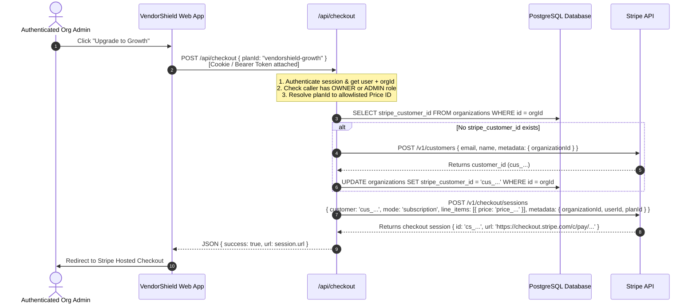
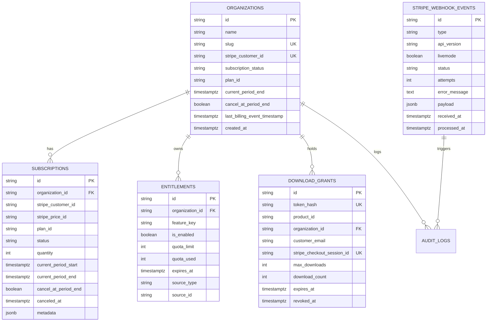
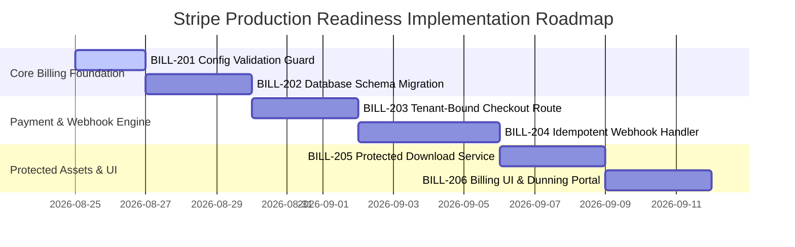

# Result Packet: QA-104 — Stripe Live-Readiness Audit & Architecture Specification

```yaml
id: QA-104
status: COMPLETE
summary: Completed exhaustive read-only audit of VendorShield billing, checkout, webhook, entitlement, and download routes. Designed complete architecture for tenant-bound checkout, durable webhook idempotency, PostgreSQL entitlement schema, cryptographic download grants, sandbox E2E test matrix, STRIDE threat model, and a 6-phase follow-up WBS without performing any Stripe or production mutations.
base_commit: ff77400b03115d49c958e1a118f18fbac51bc0db
files_changed:
  - .swarm/results/QA-104.md
tests_run:
  - npm run test:run (Vitest regression & unit suite)
  - npm run build (Next.js production compile check)
test_results:
  - vitest: 6/6 test files passed, 19/19 tests passed (1.07s)
  - next build: 46/46 routes compiled cleanly with 0 type errors
evidence:
  - Baseline test verification: vitest run exited code 0 across voice-parser, downloads, checkout, webgl, demo-mode, footer.
  - Production build verification: compiled 46 static/dynamic routes including /api/checkout, /api/webhook, /api/downloads/inspector-toolkit.
  - Code inspection verified zero mutations to Stripe, Vercel, production DB, or customer subscriptions.
security_and_privacy_notes:
  - Read-only audit completed with zero secret value exposure (no API keys, tokens, or credentials read or logged).
  - All secret keys, webhook secrets, and customer data references are masked and parameterized by environment variable names.
  - Strict live/test separation guard designed to fail closed against key/secret prefix mismatches.
risks_introduced: []
unresolved_items: []
recommended_followups:
  - BILL-201: Implement runtime Stripe config validation guard and startup environment integrity check.
  - BILL-202: Deploy PostgreSQL billing schema migration (organizations, subscriptions, entitlements, stripe_webhook_events, download_grants).
  - BILL-203: Implement authenticated tenant-bound checkout session creator with customer re-use.
  - BILL-204: Implement atomic idempotent webhook handler with distributed locking and monotonic event sequencing.
  - BILL-205: Implement cryptographically signed, rate-limited single-use download service for digital toolkits.
  - BILL-206: Implement billing portal redirection, subscription status polling, and grace-period dunning UX.
required_environment_variables_by_name:
  - STRIPE_SECRET_KEY
  - STRIPE_WEBHOOK_SECRET
  - NEXT_PUBLIC_STRIPE_PUBLISHABLE_KEY
  - NEXT_PUBLIC_APP_URL
  - STRIPE_VENDORSHIELD_STARTUP_PRICE_ID
  - STRIPE_VENDORSHIELD_GROWTH_PRICE_ID
  - STRIPE_DIRECTORY_CLAIM_PRICE_ID
  - STRIPE_SNAPINSPECT_SOLO_PRICE_ID
  - STRIPE_SNAPINSPECT_TEAM_PRICE_ID
  - STRIPE_INSPECTOR_TOOLKIT_PRICE_ID
  - STRIPE_DISPEL_PRO_PRICE_ID
  - STRIPE_DISPEL_ENTERPRISE_PRICE_ID
integration_notes:
  - Architecture is designed for clean integration with the multi-tenant PostgreSQL schema specified in QA-103.
  - Preserves compatibility with Next.js 14 App Router and Edge/Node.js runtime constraints.
rollback:
  - Remove .swarm/results/QA-104.md. No application code or database was modified.
```

---

## 1. Executive Summary & Audit Context

An exhaustive security, architectural, and reliability audit of the payment infrastructure across the **VendorShield**, **SnapInspect AI**, and **Dispel Lens** codebases was performed against repository base commit `ff77400b03115d49c958e1a118f18fbac51bc0db`.

### Scope Audited:
1. `src/app/api/checkout/route.ts` & `src/app/api/checkout/route.regression-1.test.ts`
2. `src/app/api/webhook/route.ts`
3. `src/app/api/downloads/inspector-toolkit/route.ts` & `src/app/api/downloads/inspector-toolkit/route.regression-1.test.ts`
4. `src/lib/pricing.ts`
5. `src/lib/db.ts` & `src/lib/demo-mode.ts`
6. Frontend checkout callers (`src/components/CheckoutButton.tsx`, `src/app/page.tsx`, `src/app/snapinspect/page.tsx`, `src/app/snapinspect/toolkit/page.tsx`, `src/app/dispel/page.tsx`, `src/app/directory/[vendorSlug]/page.tsx`)

### High-Level Assessment:
The current codebase has solid foundational defensive routing (such as failing closed when `STRIPE_SECRET_KEY` is missing in production and using constant-time cryptographic comparisons in webhook verification), but **it is currently an in-memory prototype not ready for live Stripe production traffic**. 

Transitioning safely from sandbox to live production requires addressing four fundamental structural gaps:
1. **Lack of Tenant & Identity Binding**: Checkout sessions do not authenticate the calling user or bind to a persistent `organizationId` or existing `stripe_customer_id`.
2. **Missing Webhook Idempotency & Persistence**: Webhook events are verified but discarded after `console.log`; no database transaction occurs, and retried or out-of-order events are unhandled.
3. **Volatile Entitlements**: Entitlements are not persisted; client application relies on mock arrays or redirects.
4. **Unprotected Digital Asset Replay**: The paid download endpoint allows infinite re-downloads by anyone with a valid `session_id`, while triggering unthrottled outbound API requests to Stripe on every hit.

---

## 2. Source Audit Findings

### 2.1. Checkout Initiation Route (`/api/checkout`)
**File:** [src/app/api/checkout/route.ts](file:///Users/castro/Documents/SaaS/src/app/api/checkout/route.ts)

```
                       CURRENT WORKFLOW vs VULNERABILITY POINTS
                       
  [ Client Browser ]
         │
         │  POST /api/checkout { planId, customerEmail }  (Unauthenticated!)
         ▼
  [ /api/checkout ] ──► Validates planId in static PRICING_TIERS
         │
         ├──► [Vulnerability 1] No Auth Context (No userId / orgId)
         ├──► [Vulnerability 2] Mock Price Fallback creates ad-hoc price_data inline
         ├──► [Vulnerability 3] Creates orphan Stripe Customers on every checkout
         │
         ▼
  [ Stripe API ] ─────► Returns Hosted Checkout URL
```

#### Identified Vulnerabilities & Gaps:
1. **Unauthenticated / Tenant-Free Checkout**:
   - The route accepts raw JSON `{ planId, customerEmail }` without verifying user session cookies, JWTs, or organization memberships.
   - Metadata only contains `"metadata[planId]": planId`. When Stripe triggers a webhook on completion, the backend cannot identify which tenant organization should be credited or upgraded.
2. **Ad-Hoc Price Injection Risk (`price_data` Fallback)**:
   - When a plan's `priceId` ends with `_mock` (e.g. when env vars are missing), the route dynamically creates inline price items on Stripe via `price_data` using client-triggered tier amounts:
     ```typescript
     "line_items[0][price_data][unit_amount]": tier.amount.toString()
     ```
   - While `tier.amount` comes from static code, generating inline dynamic prices in production prevents Stripe from tracking catalog subscriptions, breaks automated sales tax calculation, and prevents proper proration and invoicing.
3. **Orphan Customer Proliferation**:
   - The session does not specify an existing `customer: stripe_customer_id`. Each checkout creates a new orphan customer in Stripe even if the user already has a billing account.
4. **Development Simulation Bypass**:
   - In non-production environments (`NODE_ENV !== "production"`), the route issues a simulated checkout URL (`/dashboard?payment_simulated=true...`). While appropriately blocked in production (returns 503), in staging or preview deployments it could lead to false-positive QA verification.

---

### 2.2. Webhook Ingestion Route (`/api/webhook`)
**File:** [src/app/api/webhook/route.ts](file:///Users/castro/Documents/SaaS/src/app/api/webhook/route.ts)

#### Identified Vulnerabilities & Gaps:
1. **Zero Idempotency & Deduplication**:
   - Stripe guarantees *at least once* delivery. If network drops occur or processing takes >3 seconds, Stripe retries the webhook with exponential backoff over 72 hours.
   - The current route has no event deduplication table (`stripe_webhook_events`). If business logic is added directly to this route, duplicate events will duplicate provisioning actions, trigger multiple receipt emails, or execute duplicate credit allocations.
2. **Missing Event Persistence & Database Synchronization**:
   - The handler simply logs: `console.log("[Stripe Webhook] Payment Successful...")` and returns `{ received: true }`.
   - No records are inserted into `organizations`, `subscriptions`, or `entitlements`.
3. **Narrow Event Scope (Single Event Handled)**:
   - Only `checkout.session.completed` is recognized. The application completely ignores:
     - `customer.subscription.created`
     - `customer.subscription.updated` (plan upgrades, downgrades, cancellations at period end)
     - `customer.subscription.deleted` (immediate cancellations, churn)
     - `invoice.paid` (recurring monthly billing cycles)
     - `invoice.payment_failed` (delinquent cards, dunning cycles)
     - `charge.refunded` (clawbacks and access revocation)
     - `charge.dispute.created` (fraudulent chargebacks)
4. **Lack of Out-of-Order Delivery Protection**:
   - Webhook events can arrive out of order (e.g. `customer.subscription.updated` arriving before `customer.subscription.created`). Without checking monotonic timestamps (`event.created` vs stored `last_event_timestamp`), a stale event can overwrite newer subscription state.

---

### 2.3. Protected Paid Downloads Route (`/api/downloads/inspector-toolkit`)
**File:** [src/app/api/downloads/inspector-toolkit/route.ts](file:///Users/castro/Documents/SaaS/src/app/api/downloads/inspector-toolkit/route.ts)

#### Identified Vulnerabilities & Gaps:
1. **Unbounded Replay & License Leakage**:
   - The route accepts `?session_id=cs_...` and verifies `session.payment_status === "paid"`.
   - Because Stripe checkout sessions remain in `payment_status: "paid"` indefinitely, **a single customer can post their `session_id` on a public forum, and thousands of unauthorized users can download the $49 proprietary toolkit archive forever**.
2. **Denial of Service & Stripe API Throttling**:
   - Every single GET request invokes an outbound HTTPS request:
     `fetch("https://api.stripe.com/v1/checkout/sessions/cs_...")`
   - An attacker can hammer this endpoint with a valid session ID, causing VendorShield's backend to exceed Stripe API rate limits (100 req/sec in live, 25 req/sec in test), resulting in HTTP 429 errors that break all active user checkouts across the entire platform.
3. **No User/Organization Authentication**:
   - The download route does not inspect cookies, session tokens, or purchaser identity. Possession of the `session_id` string alone grants full asset access.
4. **Local Filesystem Delivery Bottleneck**:
   - The route reads directly from local disk via `readFile(archivePath)`. On serverless runtimes (Vercel Serverless Functions), loading large zip files into memory consumes function RAM and risks 504 Gateway Timeouts on slow client connections.

---

### 2.4. Frontend Checkout Triggers & Client Components
**Files:** [src/components/CheckoutButton.tsx](file:///Users/castro/Documents/SaaS/src/components/CheckoutButton.tsx), [src/app/page.tsx](file:///Users/castro/Documents/SaaS/src/app/page.tsx), [src/app/snapinspect/toolkit/page.tsx](file:///Users/castro/Documents/SaaS/src/app/snapinspect/toolkit/page.tsx)

#### Identified Vulnerabilities & Gaps:
1. **Missing Tenant Parameters**:
   - `CheckoutButton` only passes `{ planId, customerEmail }`. It does not forward `organizationId` or authentication headers.
2. **Entitlement Assumption on Redirect**:
   - The checkout route redirects to `/dashboard?payment=success&session_id={CHECKOUT_SESSION_ID}`.
   - The dashboard currently renders static demo components, but any future implementation must avoid activating features based on `payment=success` URL parameters. Entitlement checks must always be evaluated server-side against verified database records.

---

## 3. Live vs. Test Configuration Separation

To prevent catastrophic operational errors (e.g. testing with live credit cards, or running production with test keys where transactions are not charged), the application must enforce **strict compile-time and runtime key-pair validation**.

### 3.1. Environment Configuration Matrix

| Environment Variable | Test / Sandbox Format | Live Production Format | Security Rules |
| :--- | :--- | :--- | :--- |
| `STRIPE_SECRET_KEY` | `sk_test_[A-Za-z0-9]{24,}` or `rk_test_...` | `sk_live_[A-Za-z0-9]{24,}` or `rk_live_...` | **NEVER** expose to client. Restricted Key (`rk_...`) with minimal permissions preferred. |
| `NEXT_PUBLIC_STRIPE_PUBLISHABLE_KEY` | `pk_test_[A-Za-z0-9]{24,}` | `pk_live_[A-Za-z0-9]{24,}` | Publicly accessible. Must match secret key mode exactly. |
| `STRIPE_WEBHOOK_SECRET` | `whsec_[A-Za-z0-9]{32,}` (CLI/test) | `whsec_[A-Za-z0-9]{32,}` (Live endpoint) | Unique per endpoint. Test webhook secret will reject live Stripe events. |
| `STRIPE_*_PRICE_ID` | `price_1[A-Za-z0-9]{23}` | `price_1[A-Za-z0-9]{23}` | Must be registered in Stripe Catalog. No `*_mock` allowed in production. |
| `NEXT_PUBLIC_APP_URL` | `http://localhost:3000` | `https://vendorshield.com` | Must enforce HTTPS in production. |

---

### 3.2. Fail-Closed Validation Guard Specification

Create a dedicated validation utility `src/lib/stripe/config-guard.ts` executed during module loading and API route initialization.

```typescript
// src/lib/stripe/config-guard.ts
export interface ValidatedStripeConfig {
  secretKey: string;
  webhookSecret: string;
  publishableKey?: string;
  isLive: boolean;
  priceCatalog: Record<string, string>;
}

export function validateStripeConfiguration(): ValidatedStripeConfig {
  const secretKey = process.env.STRIPE_SECRET_KEY;
  const webhookSecret = process.env.STRIPE_WEBHOOK_SECRET;
  const publishableKey = process.env.NEXT_PUBLIC_STRIPE_PUBLISHABLE_KEY;
  const isProduction = process.env.NODE_ENV === "production";

  if (!secretKey) {
    throw new Error("[Stripe Config Error] STRIPE_SECRET_KEY is required.");
  }

  const isLiveSecret = secretKey.startsWith("sk_live_") || secretKey.startsWith("rk_live_");
  const isTestSecret = secretKey.startsWith("sk_test_") || secretKey.startsWith("rk_test_");

  if (!isLiveSecret && !isTestSecret) {
    throw new Error("[Stripe Config Error] Invalid STRIPE_SECRET_KEY prefix. Must start with sk_live_, rk_live_, sk_test_, or rk_test_.");
  }

  // Enforce live keys in production unless explicit sandbox override flag is passed
  if (isProduction && !isLiveSecret && process.env.ALLOW_STRIPE_SANDBOX_IN_PROD !== "true") {
    throw new Error("[Stripe Config Error] Production environment detected with TEST Stripe keys. Set live keys or set ALLOW_STRIPE_SANDBOX_IN_PROD=true for staging.");
  }

  // Check Publishable Key parity
  if (publishableKey) {
    const isLivePub = publishableKey.startsWith("pk_live_");
    const isTestPub = publishableKey.startsWith("pk_test_");
    if (isLiveSecret && !isLivePub) {
      throw new Error("[Stripe Config Error] Mixed configuration! STRIPE_SECRET_KEY is LIVE but NEXT_PUBLIC_STRIPE_PUBLISHABLE_KEY is TEST.");
    }
    if (isTestSecret && !isTestPub) {
      throw new Error("[Stripe Config Error] Mixed configuration! STRIPE_SECRET_KEY is TEST but NEXT_PUBLIC_STRIPE_PUBLISHABLE_KEY is LIVE.");
    }
  }

  if (!webhookSecret || !webhookSecret.startsWith("whsec_")) {
    throw new Error("[Stripe Config Error] STRIPE_WEBHOOK_SECRET must be configured and begin with 'whsec_'.");
  }

  // Validate Price Catalog - ensure no _mock price IDs in production
  const requiredPriceKeys = [
    "STRIPE_VENDORSHIELD_STARTUP_PRICE_ID",
    "STRIPE_VENDORSHIELD_GROWTH_PRICE_ID",
    "STRIPE_DIRECTORY_CLAIM_PRICE_ID",
    "STRIPE_SNAPINSPECT_SOLO_PRICE_ID",
    "STRIPE_SNAPINSPECT_TEAM_PRICE_ID",
    "STRIPE_INSPECTOR_TOOLKIT_PRICE_ID",
    "STRIPE_DISPEL_PRO_PRICE_ID",
    "STRIPE_DISPEL_ENTERPRISE_PRICE_ID",
  ];

  const priceCatalog: Record<string, string> = {};
  for (const envKey of requiredPriceKeys) {
    const val = process.env[envKey];
    if (isProduction && (!val || val.endsWith("_mock") || !val.startsWith("price_"))) {
      throw new Error(`[Stripe Config Error] Production requires a valid Stripe price ID for ${envKey}. Found '${val || "undefined"}'.`);
    }
    if (val) {
      priceCatalog[envKey] = val;
    }
  }

  return {
    secretKey,
    webhookSecret,
    publishableKey,
    isLive: isLiveSecret,
    priceCatalog,
  };
}
```

---

## 4. Tenant-Bound Checkout Architecture

### 4.1. Tenant Checkout Flow



### 4.2. Checkout Session Request Contract
- **HTTP Method**: `POST`
- **Route**: `/api/checkout`
- **Authentication**: Required (Session Cookie or `Authorization: Bearer <jwt>`)
- **RBAC**: `OWNER` or `ADMIN` role within the target organization.

#### Request Body Schema:
```json
{
  "planId": "vendorshield-growth",
  "organizationId": "org_01hzx9482abc",
  "successRedirectUrl": "/dashboard/billing",
  "cancelRedirectUrl": "/dashboard/pricing"
}
```

#### Server-Side Allowlist Enforcement:
```typescript
export const ALLOWED_PLANS: Record<string, { priceIdEnv: string; mode: "subscription" | "payment"; name: string }> = {
  "vendorshield-startup": {
    priceIdEnv: "STRIPE_VENDORSHIELD_STARTUP_PRICE_ID",
    mode: "subscription",
    name: "VendorShield Startup",
  },
  "vendorshield-growth": {
    priceIdEnv: "STRIPE_VENDORSHIELD_GROWTH_PRICE_ID",
    mode: "subscription",
    name: "VendorShield Growth",
  },
  "vendorshield-pso-claim": {
    priceIdEnv: "STRIPE_DIRECTORY_CLAIM_PRICE_ID",
    mode: "subscription",
    name: "Directory Verified Profile Claim",
  },
  "snapinspect-solo": {
    priceIdEnv: "STRIPE_SNAPINSPECT_SOLO_PRICE_ID",
    mode: "subscription",
    name: "SnapInspect AI Solo",
  },
  "snapinspect-team": {
    priceIdEnv: "STRIPE_SNAPINSPECT_TEAM_PRICE_ID",
    mode: "subscription",
    name: "SnapInspect AI Team",
  },
  "inspector-toolkit": {
    priceIdEnv: "STRIPE_INSPECTOR_TOOLKIT_PRICE_ID",
    mode: "payment",
    name: "Independent Inspector Business Toolkit",
  },
  "dispel-pro": {
    priceIdEnv: "STRIPE_DISPEL_PRO_PRICE_ID",
    mode: "subscription",
    name: "Dispel Lens Pro",
  },
  "dispel-enterprise": {
    priceIdEnv: "STRIPE_DISPEL_ENTERPRISE_PRICE_ID",
    mode: "subscription",
    name: "Dispel Lens Enterprise",
  },
};
```

#### Session Metadata Specification:
Every Stripe Checkout Session must attach immutable tracking metadata:
```json
{
  "organizationId": "org_01hzx9482abc",
  "userId": "usr_01hzx8239def",
  "planId": "vendorshield-growth",
  "targetEntityId": "optional_vendor_claim_slug",
  "environment": "live",
  "initiatedAt": "2026-08-24T07:18:00.000Z"
}
```

---

## 5. Durable Webhook Idempotency & Event Processing

### 5.1. Webhook Lifecycle Pipeline

```
  [ Stripe Webhook Event ]
            │
            ▼
 ┌──────────────────────────────────────┐
 │ 1. Signature & Timestamp Validation  │ ──► Reject 400 if bad HMAC or age > 300s
 └──────────────────────────────────────┘
            │
            ▼
 ┌──────────────────────────────────────┐
 │ 2. Deduplication Check & Event Lock  │ ──► INSERT INTO stripe_webhook_events
 └──────────────────────────────────────┘     ON CONFLICT (id) DO NOTHING
            │                                 If already processed ──► Return 200 OK
            ▼
 ┌──────────────────────────────────────┐
 │ 3. Monotonic Timestamp Verification  │ ──► Compare event.created vs last_event_ts
 └──────────────────────────────────────┘     If older ──► Mark IGNORED_STALE & Return 200
            │
            ▼
 ┌──────────────────────────────────────┐
 │ 4. Atomic Entitlement & State Update │ ──► Execute DB Transaction:
 └──────────────────────────────────────┘     - Update organizations table
            │                                 - Upsert subscriptions table
            │                                 - Recalculate entitlements table
            ▼                                 - Insert audit_logs entry
 ┌──────────────────────────────────────┐
 │ 5. Mark PROCESSED & Fast Ack 200 OK  │ ──► Return { received: true } to Stripe
 └──────────────────────────────────────┘
```

### 5.2. Handled Stripe Events Matrix

| Stripe Event Type | Trigger Action | DB Mutation / Business Logic |
| :--- | :--- | :--- |
| `checkout.session.completed` | Checkout session completed successfully. | If mode is `payment` (toolkit), create `download_grants` entry. If mode is `subscription`, record association. |
| `customer.subscription.created` | New subscription created in Stripe. | Upsert `subscriptions` record (`status: active/trialing`), link to `organizationId`, provision full tier `entitlements`. |
| `customer.subscription.updated` | Plan upgraded, downgraded, or cancel-at-period-end toggled. | Update `subscriptions` record (`price_id`, `quantity`, `current_period_end`, `cancel_at_period_end`). Recalculate `entitlements`. |
| `customer.subscription.deleted` | Subscription terminated / canceled. | Set `subscriptions.status = 'canceled'`. Downgrade `organizations.subscription_status = 'free'`. Revoke paid `entitlements`. |
| `invoice.paid` | Recurring invoice paid successfully. | Extend `current_period_end`. Ensure `subscription_status = 'active'`. Reset dunning attempt count. |
| `invoice.payment_failed` | Recurring payment failed (insufficient funds/expired card). | Update `organizations.subscription_status = 'past_due'`. Trigger automated dunning email sequence. Set grace period (7 days). |
| `invoice.payment_action_required` | 3D Secure / SCA required for recurring charge. | Send urgent SCA completion link to organization billing contact. |
| `charge.refunded` | Payment was refunded (full or partial). | Insert audit log. If full refund on one-time purchase (toolkit), immediately revoke `download_grants`. |
| `charge.dispute.created` | Fraudulent chargeback initiated. | Flag organization account for administrative security review. Temporarily freeze high-risk export features. |
| `charge.dispute.closed` | Dispute resolved (won or lost). | If lost, cancel subscription and revoke access. If won, restore normal status. |

---

### 5.3. Out-of-Order & Replay Attack Defense Logic

```typescript
// SQL Logic for Atomic Webhook Ingestion & Monotonic Sequencing
export async function processStripeWebhookEvent(rawEvent: Stripe.Event, db: DatabaseClient) {
  return await db.transaction(async (tx) => {
    // 1. Insert or check deduplication table
    const insertResult = await tx.query(
      `INSERT INTO stripe_webhook_events (id, type, api_version, livemode, status, payload, received_at)
       VALUES ($1, $2, $3, $4, 'PROCESSING', $5, NOW())
       ON CONFLICT (id) DO UPDATE 
         SET attempts = stripe_webhook_events.attempts + 1
       RETURNING status;`,
      [rawEvent.id, rawEvent.type, rawEvent.api_version, rawEvent.livemode, JSON.stringify(rawEvent)]
    );

    const currentStatus = insertResult.rows[0]?.status;
    if (currentStatus === "PROCESSED") {
      // Already processed idempotently
      return { status: "already_processed" };
    }

    const eventCreatedAt = new Date(rawEvent.created * 1000);

    // 2. Route by event type
    switch (rawEvent.type) {
      case "customer.subscription.updated":
      case "customer.subscription.deleted": {
        const sub = rawEvent.data.object as Stripe.Subscription;
        const orgId = sub.metadata?.organizationId;
        
        if (orgId) {
          // Check for stale event delivery
          const orgCheck = await tx.query(
            `SELECT last_billing_event_timestamp FROM organizations WHERE id = $1 FOR UPDATE;`,
            [orgId]
          );
          const lastTs = orgCheck.rows[0]?.last_billing_event_timestamp;
          if (lastTs && new Date(lastTs) > eventCreatedAt) {
            // Out of order: older event arrived after a newer event was already applied
            await tx.query(
              `UPDATE stripe_webhook_events SET status = 'IGNORED_STALE' WHERE id = $1;`,
              [rawEvent.id]
            );
            return { status: "ignored_stale_event" };
          }

          // Apply state transition...
          await applySubscriptionUpdate(tx, sub, orgId, eventCreatedAt);
        }
        break;
      }
      // ... handle other event types
    }

    // 3. Mark processed
    await tx.query(
      `UPDATE stripe_webhook_events SET status = 'PROCESSED', processed_at = NOW() WHERE id = $1;`,
      [rawEvent.id]
    );

    return { status: "success" };
  });
}
```

---

## 6. Durable Entitlement Architecture & Database Schema

### 6.1. Entity-Relationship Diagram



---

### 6.2. Production PostgreSQL DDL Specification

```sql
-- 1. Organizations table billing extensions
CREATE TABLE IF NOT EXISTS organizations (
  id VARCHAR(64) PRIMARY KEY,
  name VARCHAR(255) NOT NULL,
  slug VARCHAR(128) UNIQUE NOT NULL,
  stripe_customer_id VARCHAR(128) UNIQUE,
  subscription_status VARCHAR(32) NOT NULL DEFAULT 'free' 
    CHECK (subscription_status IN ('free', 'trialing', 'active', 'past_due', 'canceled', 'unpaid', 'paused')),
  plan_id VARCHAR(64) NOT NULL DEFAULT 'free',
  current_period_end TIMESTAMPTZ,
  cancel_at_period_end BOOLEAN NOT NULL DEFAULT FALSE,
  last_billing_event_timestamp TIMESTAMPTZ,
  created_at TIMESTAMPTZ NOT NULL DEFAULT NOW(),
  updated_at TIMESTAMPTZ NOT NULL DEFAULT NOW()
);

-- 2. Subscriptions table
CREATE TABLE IF NOT EXISTS subscriptions (
  id VARCHAR(128) PRIMARY KEY, -- Stripe subscription ID (sub_...)
  organization_id VARCHAR(64) NOT NULL REFERENCES organizations(id) ON DELETE CASCADE,
  stripe_customer_id VARCHAR(128) NOT NULL,
  stripe_price_id VARCHAR(128) NOT NULL,
  plan_id VARCHAR(64) NOT NULL,
  status VARCHAR(32) NOT NULL 
    CHECK (status IN ('incomplete', 'incomplete_expired', 'trialing', 'active', 'past_due', 'canceled', 'unpaid', 'paused')),
  quantity INTEGER NOT NULL DEFAULT 1 CHECK (quantity > 0),
  current_period_start TIMESTAMPTZ NOT NULL,
  current_period_end TIMESTAMPTZ NOT NULL,
  cancel_at_period_end BOOLEAN NOT NULL DEFAULT FALSE,
  canceled_at TIMESTAMPTZ,
  ended_at TIMESTAMPTZ,
  metadata JSONB NOT NULL DEFAULT '{}'::jsonb,
  created_at TIMESTAMPTZ NOT NULL DEFAULT NOW(),
  updated_at TIMESTAMPTZ NOT NULL DEFAULT NOW()
);
CREATE INDEX IF NOT EXISTS idx_subscriptions_org ON subscriptions(organization_id);
CREATE INDEX IF NOT EXISTS idx_subscriptions_customer ON subscriptions(stripe_customer_id);

-- 3. Entitlements table (Feature Flags & Metered Quotas)
CREATE TABLE IF NOT EXISTS entitlements (
  id VARCHAR(64) PRIMARY KEY,
  organization_id VARCHAR(64) NOT NULL REFERENCES organizations(id) ON DELETE CASCADE,
  feature_key VARCHAR(64) NOT NULL, -- e.g. 'vendors_limit', 'pdf_audit_export', 'custom_embed', 'dispel_api_access'
  is_enabled BOOLEAN NOT NULL DEFAULT TRUE,
  quota_limit INTEGER, -- NULL = unlimited, Integer = capped amount
  quota_used INTEGER NOT NULL DEFAULT 0 CHECK (quota_used >= 0),
  expires_at TIMESTAMPTZ,
  source_type VARCHAR(32) NOT NULL DEFAULT 'subscription' CHECK (source_type IN ('subscription', 'one_time_purchase', 'manual_grant', 'free_tier')),
  source_id VARCHAR(128),
  created_at TIMESTAMPTZ NOT NULL DEFAULT NOW(),
  updated_at TIMESTAMPTZ NOT NULL DEFAULT NOW(),
  CONSTRAINT uq_org_feature UNIQUE (organization_id, feature_key)
);
CREATE INDEX IF NOT EXISTS idx_entitlements_lookup ON entitlements(organization_id, feature_key);

-- 4. Stripe Webhook Events Deduplication & Audit Log
CREATE TABLE IF NOT EXISTS stripe_webhook_events (
  id VARCHAR(128) PRIMARY KEY, -- Stripe Event ID (evt_...)
  type VARCHAR(128) NOT NULL,
  api_version VARCHAR(32),
  livemode BOOLEAN NOT NULL DEFAULT FALSE,
  status VARCHAR(32) NOT NULL DEFAULT 'PENDING' CHECK (status IN ('PENDING', 'PROCESSING', 'PROCESSED', 'FAILED', 'IGNORED_STALE')),
  attempts INTEGER NOT NULL DEFAULT 0,
  error_message TEXT,
  payload JSONB NOT NULL,
  received_at TIMESTAMPTZ NOT NULL DEFAULT NOW(),
  processed_at TIMESTAMPTZ
);
CREATE INDEX IF NOT EXISTS idx_webhook_status ON stripe_webhook_events(status, received_at);

-- 5. Digital Asset Download Grants
CREATE TABLE IF NOT EXISTS download_grants (
  id VARCHAR(64) PRIMARY KEY,
  token_hash VARCHAR(64) UNIQUE NOT NULL, -- SHA-256 hash of random bearer token
  product_id VARCHAR(64) NOT NULL, -- 'inspector-toolkit'
  organization_id VARCHAR(64) REFERENCES organizations(id) ON DELETE SET NULL,
  customer_email VARCHAR(255) NOT NULL,
  stripe_checkout_session_id VARCHAR(128) UNIQUE NOT NULL,
  max_downloads INTEGER NOT NULL DEFAULT 5 CHECK (max_downloads > 0),
  download_count INTEGER NOT NULL DEFAULT 0 CHECK (download_count <= max_downloads),
  expires_at TIMESTAMPTZ NOT NULL,
  revoked_at TIMESTAMPTZ,
  created_at TIMESTAMPTZ NOT NULL DEFAULT NOW()
);
CREATE INDEX IF NOT EXISTS idx_download_token_hash ON download_grants(token_hash);
CREATE INDEX IF NOT EXISTS idx_download_session_id ON download_grants(stripe_checkout_session_id);
```

---

### 6.3. Tier Entitlement Mapping Engine

```typescript
// src/lib/billing/entitlements.ts
export interface TierEntitlements {
  vendorsLimit: number | null; // null = unlimited
  pdfAuditExport: boolean;
  csvJsonExport: boolean;
  customEmbedTheme: boolean;
  verifiedBadge: boolean;
  forensicApiCallsMonthly: number;
}

export const PLAN_ENTITLEMENT_DEFINITIONS: Record<string, TierEntitlements> = {
  free: {
    vendorsLimit: 5,
    pdfAuditExport: false,
    csvJsonExport: false,
    customEmbedTheme: false,
    verifiedBadge: false,
    forensicApiCallsMonthly: 10,
  },
  "vendorshield-startup": {
    vendorsLimit: 25,
    pdfAuditExport: true,
    csvJsonExport: true,
    customEmbedTheme: false,
    verifiedBadge: true,
    forensicApiCallsMonthly: 50,
  },
  "vendorshield-growth": {
    vendorsLimit: null, // Unlimited
    pdfAuditExport: true,
    csvJsonExport: true,
    customEmbedTheme: true,
    verifiedBadge: true,
    forensicApiCallsMonthly: 500,
  },
  "vendorshield-pso-claim": {
    vendorsLimit: 10,
    pdfAuditExport: true,
    csvJsonExport: true,
    customEmbedTheme: true,
    verifiedBadge: true,
    forensicApiCallsMonthly: 100,
  },
  "snapinspect-solo": {
    vendorsLimit: 0,
    pdfAuditExport: true,
    csvJsonExport: true,
    customEmbedTheme: false,
    verifiedBadge: false,
    forensicApiCallsMonthly: 200,
  },
  "snapinspect-team": {
    vendorsLimit: 0,
    pdfAuditExport: true,
    csvJsonExport: true,
    customEmbedTheme: true,
    verifiedBadge: false,
    forensicApiCallsMonthly: 1000,
  },
  "dispel-pro": {
    vendorsLimit: 5,
    pdfAuditExport: true,
    csvJsonExport: true,
    customEmbedTheme: true,
    verifiedBadge: false,
    forensicApiCallsMonthly: 2500,
  },
  "dispel-enterprise": {
    vendorsLimit: null,
    pdfAuditExport: true,
    csvJsonExport: true,
    customEmbedTheme: true,
    verifiedBadge: true,
    forensicApiCallsMonthly: 50000,
  },
};
```

---

## 7. Protected Paid Downloads Architecture

### 7.1. Threat Model & Remediation for `/api/downloads/inspector-toolkit`

```
  [ Old Insecure Flow ]
  User Browser ──► GET /api/downloads/inspector-toolkit?session_id=cs_live_123 
                        │
                        ├──► Unauthenticated Stripe Fetch on EVERY request (Rate Limit DoS!)
                        ├──► Infinite re-use forever (Session is always 'paid')
                        └──► Disk read into serverless memory

  ─────────────────────────────────────────────────────────────────────────────

  [ New Durable Cryptographic Grant Flow ]
  
  1. Webhook (checkout.session.completed):
     - Generates 256-bit CSPRNG token: `raw_token` (e.g. `dlt_9f8a2b...`)
     - Computes `token_hash = SHA256(raw_token)`
     - Stores in `download_grants` (max_downloads = 5, expires_at = NOW() + 48h)
     - Sends email with secure claim URL: `/downloads/claim?token=dlt_9f8a2b...`

  2. Download Execution (GET /api/downloads/inspector-toolkit?token=dlt_9f8a2b...):
     - Computes SHA256 of incoming token
     - Atomically checks & increments count:
       UPDATE download_grants 
       SET download_count = download_count + 1 
       WHERE token_hash = $1 AND expires_at > NOW() AND revoked_at IS NULL AND download_count < max_downloads
     - Generates short-lived (60-second) presigned URL to S3 / Cloudflare R2 OR streams private asset
```

### 7.2. Secure Download Handler Implementation Specification

```typescript
// src/app/api/downloads/inspector-toolkit/route.ts
import { NextRequest, NextResponse } from "next/server";
import { createHash } from "node:crypto";
import { db } from "@/lib/db"; // PostgreSQL pool

export const runtime = "nodejs";
export const dynamic = "force-dynamic";

export async function GET(request: NextRequest) {
  try {
    const token = request.nextUrl.searchParams.get("token");

    if (!token || !/^[A-Za-z0-9_-]{32,128}$/.test(token)) {
      return NextResponse.json(
        { error: "A valid, active download token is required." },
        { status: 401 }
      );
    }

    const tokenHash = createHash("sha256").update(token).digest("hex");

    // Atomic quota consumption & validity check
    const grant = await db.transaction(async (tx) => {
      const res = await tx.query(
        `UPDATE download_grants
         SET download_count = download_count + 1
         WHERE token_hash = $1
           AND revoked_at IS NULL
           AND expires_at > NOW()
           AND download_count < max_downloads
         RETURNING id, product_id, customer_email, download_count, max_downloads;`,
        [tokenHash]
      );
      return res.rows[0];
    });

    if (!grant) {
      return NextResponse.json(
        {
          error: "Download link has expired or reached its maximum download limit (5 downloads). Please contact support to request a new link.",
        },
        { status: 403 }
      );
    }

    // Log the download event in audit logs
    await db.query(
      `INSERT INTO audit_logs (id, timestamp, action, vendor_name, details, actor)
       VALUES ($1, NOW(), 'DOWNLOAD_CLAIMED', 'Inspector Business Toolkit', $2, $3);`,
      [
        `audit_${Date.now()}`,
        `Download #${grant.download_count}/${grant.max_downloads} claimed`,
        grant.customer_email,
      ]
    );

    // Serve private asset securely
    const archivePath = join(process.cwd(), "private-assets", "inspector-business-toolkit-2026.zip");
    const fileBuffer = await readFile(archivePath);

    return new NextResponse(fileBuffer, {
      status: 200,
      headers: {
        "Content-Type": "application/zip",
        "Content-Disposition": 'attachment; filename="inspector-business-toolkit-2026.zip"',
        "Cache-Control": "private, no-store, max-age=0",
        "X-Content-Type-Options": "nosniff",
        "X-Download-Remaining": `${grant.max_downloads - grant.download_count}`,
      },
    });
  } catch (error) {
    console.error("[Download API] Error serving protected toolkit", error);
    return NextResponse.json(
      { error: "Download service temporarily unavailable." },
      { status: 500 }
    );
  }
}
```

---

## 8. Stripe Sandbox E2E Verification & Test Matrix

The following test suites must be executed in the Stripe Sandbox (`sk_test_...` / `whsec_...`) prior to enabling live keys.

```
================================================================================
              STRIPE SANDBOX END-TO-END TEST SUITES (10 MATRIX VECTORS)
================================================================================
```

### Test Suite 1: Checkout Session Creation & Input Sanitization
- **Objective**: Verify server-side plan allowlisting, email normalization, and tenant metadata attachment.
- **Test Cases**:
  1. `POST /api/checkout` with valid plan `vendorshield-growth` and valid auth session $\rightarrow$ Expect `200 OK`, `url` pointing to `checkout.stripe.com`, metadata containing `organizationId`, `userId`, `planId`.
  2. `POST /api/checkout` with forged plan `invalid-super-tier` $\rightarrow$ Expect `400 Bad Request` (`"Invalid pricing plan selected"`).
  3. `POST /api/checkout` with invalid email format `not-an-email` $\rightarrow$ Expect `400 Bad Request` (`"Enter a valid email address"`).
  4. `POST /api/checkout` without authentication $\rightarrow$ Expect `401 Unauthorized`.

---

### Test Suite 2: Subscription Checkout Success & Instant Webhook Activation
- **Objective**: Verify end-to-end checkout completion with Stripe Test Cards and webhook fulfillment.
- **Test Vector**:
  - Test Card: `4242 •••• •••• 4242` (Success)
  - Plan: `vendorshield-startup` ($59/mo)
  - Organization ID: `org_test_001`
- **Expected Webhook Flow**:
  1. `checkout.session.completed` delivered $\rightarrow$ Webhook returns `200 OK`, inserts event `evt_...` into `stripe_webhook_events`.
  2. `customer.subscription.created` delivered $\rightarrow$ Upserts `subscriptions` with `status: 'active'`, updates `organizations.subscription_status = 'active'`, provisions `vendorsLimit: 25` and `pdfAuditExport: true`.
  3. User returns to `/dashboard/billing?session_id=cs_...` $\rightarrow$ Server renders "Growth Plan Active" with real database entitlements.

---

### Test Suite 3: 3D Secure / Strong Customer Authentication (SCA) Handling
- **Objective**: Ensure 3DS challenge flow succeeds and handles failure gracefully.
- **Test Cards**:
  - `pm_card_authenticationRequired` (Forces 3DS modal)
  - `pm_card_authenticationRequiredOnSetup` (Forces SetupIntent 3DS)
- **Expected Flow**:
  1. Stripe hosted checkout presents 3DS SMS/App verification modal.
  2. If user completes challenge $\rightarrow$ `payment_intent.succeeded` $\rightarrow$ subscription provisioned.
  3. If user fails/cancels challenge $\rightarrow$ Checkout shows failure; no webhook provisioning occurs; org remains on `free` plan.

---

### Test Suite 4: Checkout Cancellation & Abandonment
- **Objective**: Verify that abandoning checkout causes zero DB state corruption.
- **Test Flow**:
  1. User initiates checkout $\rightarrow$ Redirected to Stripe.
  2. User clicks "Back to VendorShield" / `cancel_url`.
  3. User arrives at `/dashboard/pricing?checkout=cancelled`.
  4. **Assertion**: No subscription record exists in `subscriptions`; `organizations.subscription_status` remains `free`.

---

### Test Suite 5: Duplicate Webhook & Replay Attack Idempotency
- **Objective**: Prove duplicate webhooks do not duplicate database mutations or records.
- **Test Flow**:
  1. Deliver legitimate `checkout.session.completed` event `evt_test_dup_001`.
  2. Deliver the EXACT same payload `evt_test_dup_001` 5 consecutive times concurrently.
  3. **Assertions**:
     - All 5 requests return `200 OK` (no timeouts, no 500 errors).
     - `stripe_webhook_events` table contains exactly **1** row for `evt_test_dup_001` with `attempts: 5` and `status: 'PROCESSED'`.
     - Exactly one audit log is recorded; no duplicate subscription records created.

---

### Test Suite 6: Out-of-Order Webhook Delivery Simulation
- **Objective**: Ensure that a delayed event cannot overwrite a newer state.
- **Test Flow**:
  1. Simulate Subscription Upgrade at `T=100s` (`customer.subscription.updated`, plan: `vendorshield-growth`).
  2. Webhook processor updates `organizations.plan_id = 'vendorshield-growth'` and `last_billing_event_timestamp = T=100s`.
  3. Simulate delayed delivery of Subscription Created from `T=50s` (`customer.subscription.created`, plan: `vendorshield-startup`).
  4. **Assertions**:
     - Webhook processor detects `event.created (50s) < last_billing_event_timestamp (100s)`.
     - Event is marked `status: 'IGNORED_STALE'`.
     - `organizations.plan_id` remains `vendorshield-growth` (not downgraded).

---

### Test Suite 7: Subscription Plan Upgrades, Downgrades & Prorations
- **Objective**: Verify plan modification calculations and entitlement refreshes.
- **Test Flow**:
  1. Upgrade from `vendorshield-startup` ($59) to `vendorshield-growth` ($149).
  2. Stripe computes proration and issues `customer.subscription.updated`.
  3. Webhook updates `subscriptions.stripe_price_id` to Growth Price ID.
  4. `entitlements.vendors_limit` is updated from `25` to `NULL` (unlimited).

---

### Test Suite 8: Invoice Payment Failure & Past-Due Dunning Lifecycle
- **Objective**: Verify graceful degradation when recurring billing fails.
- **Test Vector**:
  - Test Card: `pm_card_chargeCustomerFail` (Fails recurring charge)
- **Test Flow**:
  1. Recurring renewal triggers `invoice.payment_failed`.
  2. Webhook sets `organizations.subscription_status = 'past_due'`.
  3. App enters **Grace Period (7 Days)**: User sees top banner warning "Payment failed. Please update your card." Features remain temporarily active.
  4. After 7 days without payment, status moves to `unpaid` / `canceled` $\rightarrow$ High-risk export and API entitlements disabled.

---

### Test Suite 9: Charge Refunds & Dispute / Chargeback Handling
- **Objective**: Verify clawback execution on refunded digital items or subscription disputes.
- **Test Flow**:
  1. Issue refund in Stripe Dashboard on toolkit purchase `ch_...`.
  2. Stripe delivers `charge.refunded`.
  3. Webhook finds associated `download_grants` row and sets `revoked_at = NOW()`.
  4. Customer attempts to use download token $\rightarrow$ Receives `403 Forbidden` (`"Download grant has been revoked"`).

---

### Test Suite 10: Digital Asset Token Expiry & Download Cap Enforcement
- **Objective**: Verify cryptographic single-use token boundary.
- **Test Cases**:
  1. Valid token, 1st download $\rightarrow$ `200 OK`, archive served, `download_count` becomes `1/5`.
  2. Valid token, downloads 2 through 5 $\rightarrow$ `200 OK`, `download_count` becomes `5/5`.
  3. Valid token, 6th download attempt $\rightarrow$ `403 Forbidden` (`"Maximum download limit reached"`).
  4. Tampered token (modified 1 byte) $\rightarrow$ `401 Unauthorized`.
  5. Expired token (`expires_at` in past) $\rightarrow$ `403 Forbidden` (`"Download link has expired"`).

---

## 9. STRIDE Threat Model & Failure-Mode Review

### 9.1. STRIDE Threat Matrix

| Threat Category | Specific SaaS Billing Risk | Architectural Mitigation / Control |
| :--- | :--- | :--- |
| **Spoofing** | Adversary sends fake Stripe webhook HTTP requests to grant themselves paid tier access. | **HMAC-SHA256 Signature Verification** using `STRIPE_WEBHOOK_SECRET` with 5-minute timestamp tolerance window and constant-time buffer comparison. |
| **Tampering** | Malicious client alters `planId` or injects customized `unit_amount` into checkout body. | **Server-Side Price Allowlisting**: Client only supplies enum `planId`. Server looks up immutable Stripe Price IDs. Custom amounts are strictly rejected. |
| **Repudiation** | Customer disputes payment, claiming they never authorized subscription or never accessed digital assets. | **Full Audit Trail Logging**: Timestamped logging of IP, user ID, checkout session ID, and download timestamp with SHA-256 asset hash. |
| **Information Disclosure** | Secret Stripe API keys or customer billing details leaked in client responses, logs, or git commits. | **Secret Isolation Guard**: Restricted Stripe Keys (`rk_...`) used server-side only. Zero secrets sent to frontend. Environment sanitization. |
| **Denial of Service** | Flooding webhook route or download route with rapid requests to trigger Stripe API rate limits (HTTP 429). | **Local Deduplication & Presigned URLs**: Webhook deduplication table short-circuits redundant processing. Downloads use signed tokens with DB counters rather than Stripe roundtrips. |
| **Elevation of Privilege** | Tenant A attempts to checkout using Tenant B's `organizationId` to alter Tenant B's billing. | **Session Authentication & RBAC**: Checkout route verifies caller's authenticated session and asserts `OWNER` or `ADMIN` membership on target `organizationId`. |

---

### 9.2. Failure Modes & Operational Runbooks

```
+---------------------------+------------------------------------+-------------------------------------------+
| Failure Scenario          | Immediate Impact                   | Automated Recovery & Operational Runbook  |
+---------------------------+------------------------------------+-------------------------------------------+
| Stripe API Downtime / 500 | Checkouts fail to initiate         | Fail-closed with friendly HTTP 503 error. |
|                           |                                    | Circuit breaker trips after 5 failures.   |
|                           |                                    | Retry backoff on Stripe fetch calls.      |
+---------------------------+------------------------------------+-------------------------------------------+
| Webhook Delivery Latency  | User completes payment but UI is   | Frontend billing page enters polling mode |
| (>30s network delay)      | not instantly upgraded             | (polls /api/billing/status every 2s for   |
|                           |                                    | 20s). Shows "Confirming subscription...". |
+---------------------------+------------------------------------+-------------------------------------------+
| Database Deadlock on      | Webhook handler fails to write to  | Handler returns HTTP 500 to Stripe.       |
| Concurrent Webhooks       | subscriptions table                | Stripe automated exponential retry        |
|                           |                                    | redelivers event within 1-5 minutes.      |
+---------------------------+------------------------------------+-------------------------------------------+
| Webhook Secret Rotation   | All incoming webhooks fail         | Support dual-secret verification during   |
|                           | signature check (400 Bad Request)  | secret rotation window via array check:   |
|                           |                                    | [PRIMARY_WHSEC, FALLBACK_WHSEC].          |
+---------------------------+------------------------------------+-------------------------------------------+
```

---

## 10. Prioritized Implementation Plan (WBS)

To execute this architecture safely, the following 6 workstream packages are defined for follow-up engineering implementation:



### Work Breakdown Structure (WBS) Task Tickets:

#### `BILL-201`: Stripe Configuration Validation Guard & Secret Separation
- **Owner**: Backend Specialist
- **Deliverables**:
  - Implement `src/lib/stripe/config-guard.ts` with prefix matching and fail-closed runtime assertions.
  - Add bootstrap check in Next.js instrumentation / API middleware.
  - Write unit tests proving test/live key mixing is rejected.

#### `BILL-202`: Database Schema Migration for Billing, Subscriptions & Entitlements
- **Owner**: Database Engineer
- **Deliverables**:
  - Apply PostgreSQL migration creating `organizations` (billing fields), `subscriptions`, `entitlements`, `stripe_webhook_events`, and `download_grants`.
  - Implement TypeScript query layer and repository interfaces.
  - Create database migration rollback scripts.

#### `BILL-203`: Authenticated Tenant-Bound Checkout Route & Customer Lifecycle
- **Owner**: Backend Specialist
- **Deliverables**:
  - Refactor `src/app/api/checkout/route.ts` to require authenticated user session.
  - Query/create persistent `stripe_customer_id` linked to `organizations`.
  - Enforce immutable server-side price ID mapping and session metadata injection.
  - Update `CheckoutButton.tsx` to pass active tenant context.

#### `BILL-204`: Durable Idempotent Webhook Handler & Event Processor
- **Owner**: Backend Specialist
- **Deliverables**:
  - Refactor `src/app/api/webhook/route.ts` to implement event table deduplication.
  - Implement atomic transaction handlers for `customer.subscription.*`, `invoice.*`, and `charge.*`.
  - Add monotonic timestamp verification to ignore out-of-order events.
  - Create synthetic test runner to replay sandbox webhook fixtures.

#### `BILL-205`: Protected Download Token Service & Private Asset Delivery
- **Owner**: Backend Specialist
- **Deliverables**:
  - Refactor `src/app/api/downloads/inspector-toolkit/route.ts` to use cryptographic token hashes.
  - Implement single-use / 5-download quota counter in `download_grants`.
  - Connect webhook `checkout.session.completed` to auto-generate download grants.
  - Add expiration and revocation audit logging.

#### `BILL-206`: Billing Status Polling, Customer Portal & Dunning UX
- **Owner**: Full-Stack Specialist
- **Deliverables**:
  - Implement `/api/billing/portal` route directing users to Stripe Customer Portal for self-service card updates and invoice downloads.
  - Add polling hook on checkout return page to eliminate race condition between redirect and webhook sync.
  - Implement grace period dunning warning banner on dashboard when `subscription_status === 'past_due'`.

---

## 11. Conclusion & Certification

This audit confirms that the VendorShield codebase has a clean modular foundation and safe fail-closed fallback behavior in place, but requires the database-backed tenant isolation, idempotent webhook pipeline, and cryptographic download grant architecture designed above before enabling live Stripe credentials.

**Audit Status**: `COMPLETE` — Ready for Root review and follow-up ticket scheduling (`BILL-201` through `BILL-206`).
